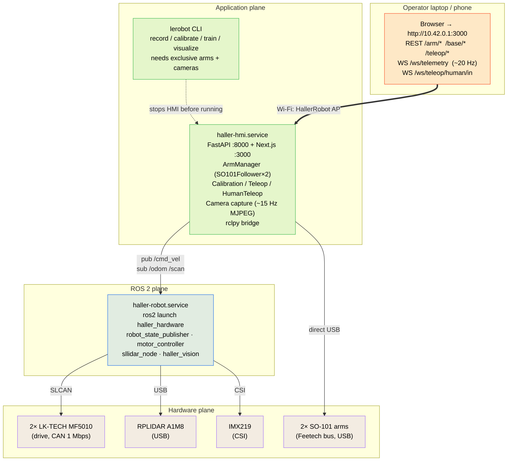

This page is the one-screen mental model. Every subsystem has its own deeper page; this is the diagram that says where each one sits.

## The three planes

Three observations from this picture:

1. **The HMI does not go through ROS for the arms.** It opens the Feetech bus directly via `lerobot`'s `SO101Follower` class. The arms and the base each have their own control path — they only meet in the HMI's `state_snapshot` for the dashboard.
2. **The HMI and the ROS stack are sibling services, not parent/child.** Either can run without the other. The HMI just sees `/cmd_vel` / `/odom` / `/scan` as topics; the ROS stack doesn't know the HMI exists.
3. **`lerobot` CLI tools and the HMI compete for the same physical resources** (USB arm buses + cameras). That's why dataset collection requires stopping the HMI first.

## Process boundaries on the Jetson

Three systemd services compose at boot, with `haller-ap` ordered first so the network is up before anything binds to it:

| Service | What runs | Talks to |
|---|---|---|
| `haller-ap.service` | `nmcli` AP setup (oneshot) | The radio. Brings up `HallerRobot` SSID @ 10.42.0.1/24. |
| `haller-robot.service` | `ros2 launch haller_hardware haller_bringup.launch.py` | CAN bus, RPLIDAR USB, CSI camera. Publishes ROS topics. |
| `haller-hmi.service` | `uvicorn` on :8000 + Next.js on :3000 | Feetech buses (arms), USB webcams, ROS topics (subscribes /odom /scan, publishes /cmd_vel). |

See [Jetson deployment](/docs/deployment/jetson) for the install/start/stop story and [Wi-Fi AP fallback](/docs/deployment/wifi-ap) for the AP piece in detail.

## Wire protocols, summarized

| Wire | What it carries | Direction |
|---|---|---|
| CAN 1 Mbps (SLCAN/USB) | LK-TECH motor frames (commands, encoder reads) | bi-directional, HMI/ROS → motors → ROS |
| Feetech half-duplex USB-TTL | Servo position read/write to STS3215s | bi-directional, HMI ↔ arm |
| CSI (IMX219) | Raw frames into `haller_vision` | camera → ROS |
| V4L2 USB (webcams) | Raw frames into HMI (live MJPEG + dataset capture) | camera → HMI |
| ROS topics | `/cmd_vel`, `/odom`, `/scan`, `/tf`, `/joint_states` | between `haller-robot` ↔ HMI / Nav2 / debug |
| REST `:8000` | HMI commands (arm goals, mode, teleop, calib) | browser → HMI |
| WS `/ws/telemetry` | 20 Hz state frames (base + arms + teleop + alerts) | HMI → browser |
| WS `/ws/teleop/human/in` | MediaPipe keypoint frames (one per render tick) | browser → HMI |
| Wi-Fi (HallerRobot AP) | Everything above the Jetson | operator ↔ Jetson |

## Off-board planes

The diagram above is what runs on the robot. Two off-board planes also matter:

### Dataset collection (operator laptop → HF Hub)

`scripts/record_dataset.sh` wraps `lerobot-record`, which:

- needs exclusive control of both arm buses + the webcams (so the HMI must be stopped),
- drives the **leader** by hand and **records** the follower + cameras in lockstep,
- writes a parquet+MP4 [LeRobotDataset](https://huggingface.co/docs/lerobot/datasets) and pushes it to your Hugging Face Hub repo.

Full guide: [Dataset collection](/docs/data/dataset-collection).

### VLA inference + finetuning (RunPod GPU)

The local Jetson is too small for any interesting generalist VLA (π0.5, GR00T N1.7, X-VLA). The pattern is:

1. Record an SO-101 dataset locally → push to HF Hub.
2. Spin up a RunPod 4090 (or A100 for full finetune).
3. **Replay-eval** an off-the-shelf policy against the dataset (open-loop sanity check — no robot, no network risk).
4. **LoRA finetune** on the dataset (~1.5 h on a 4090).
5. Replay-eval the finetuned policy to confirm the loss actually went somewhere useful.

The Jetson never participates in this loop. Closed-loop deployment (policy on the pod, arm at home over the network) is intentionally future work — see the roadmap entries in [Dataset collection](/docs/data/dataset-collection#roadmap) and [RunPod inference](/docs/data/runpod-inference#what-this-guide-doesnt-cover-yet).

## State that crosses planes

A few values appear at multiple layers; knowing which one is canonical avoids confusion:

| Thing | Canonical source | Cached in |
|---|---|---|
| Arm joint positions | Feetech servo `ReadStatus2` | HMI `state_snapshot` → telemetry WS frame → dashboard slider value |
| Arm calibration | `~/.cache/huggingface/lerobot/calibration/{robots,teleoperators}/.../<id>.json` | HMI `ArmManager` loads on connect; calibration wizard rewrites with `.bak-<ts>` sidecar |
| Saved poses | `~/.haller/presets.json` | HMI `PresetStore`; written on Save, read on dashboard load |
| Base velocity | What was last `POST`ed to `/base/cmd_vel`, with 0.5 s timeout | `motor_controller_node` → CAN frames → wheel encoders → `/odom` |
| Camera config | `hmi/backend/config.yaml` | The same struct feeds the HMI live view *and* `lerobot-record` |
| Teleop kind | One global `HumanTeleopSession` + one `TeleopSession`, mutually exclusive | Reflected in telemetry, enforced by 409 across both `/teleop/*` endpoints |

## E-STOP semantics

A single E-STOP button (top-right of every HMI page) hits the `POST /estop` endpoint, which:

1. Stops any active teleop session (leader/follower or human) **before** disabling torque (so the follower doesn't lurch toward a stale queued goal).
2. Aborts any in-flight calibration session.
3. Drops torque on every configured arm.
4. Zeroes `/cmd_vel`.
5. Shows the E-STOP banner; mode toggles and slider writes are blocked until E-STOP is cleared.

The base motors' 0.5 s `cmd_vel_timeout` is the independent secondary safety — even with no E-STOP, the wheels stop within half a second of the HMI going silent.

## Where to go next from here

| If you want to… | Start at |
|---|---|
| Build a Haller from parts | [BOM](/docs/hardware/bom) + [Build instructions](/docs/hardware/build) |
| Bring up the ROS / base stack | [Mobile base (ROS 2)](/docs/base/overview) |
| Configure and calibrate the arms | [LeRobot environment](/docs/setup/lerobot-environment) → [SO-101 arms](/docs/setup/so101-arm) |
| Drive the robot from a browser | [HMI overview](/docs/hmi/overview) |
| Hand-pose teleop from a laptop webcam | [Human-pose teleop](/docs/hmi/human-teleop) |
| Record demonstration data | [Dataset collection](/docs/data/dataset-collection) |
| Run a VLA against your data | [RunPod inference](/docs/data/runpod-inference) |
| Deploy onto a fresh Jetson | [Jetson deployment](/docs/deployment/jetson) |
