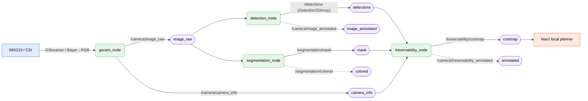

`haller_vision` is the perception side of the mobile base. It runs alongside `haller_motor_controller` and `sllidar_node` inside `haller-robot.service` and produces a Nav2-shaped costmap from a single CSI camera.

The package lives at [`src/haller_ros/haller_common/haller_vision/`](https://github.com/oscardvs/haller_ws/tree/main/src/haller_ros/haller_common/haller_vision). It's modular — each layer can be toggled off via a launch arg, so you can run camera-only on a dev laptop or full pipeline on the Jetson.

## Dataflow



Solid arrows are the critical path (sensor → planner). Dashed arrows are visualization-only outputs you can subscribe to from RViz but the rest of the stack doesn't need.

Three observations:

1. **The camera is upstream of everything.** If `/camera/image_raw` doesn't tick, the whole pipeline is dark — that's the first place to look when the costmap goes empty.
2. **Detection and segmentation run in parallel** off the same image topic, then both feed into `traversability_node`. Inference latency is the sum of *the slower of the two* plus the traversability pass — not all three serially.
3. **The output is a Nav2 `OccupancyGrid`**, identical in shape to what `slam_toolbox` produces from the lidar — Nav2 just sees another costmap layer.

## What each node does

### `gscam_node` — camera capture

GStreamer-based ROS 2 camera driver. Reads from the CSI device (`/dev/video0`), de-Bayers RGGB → RGB, publishes at 30 fps. The GStreamer pipeline string lives in [`config/camera/imx219_hardware.yaml`](https://github.com/oscardvs/haller_ws/blob/main/src/haller_ros/haller_common/haller_vision/config/camera/imx219_hardware.yaml).

In simulation (`use_sim:=true`), `gscam_node` is **not** launched — the Gazebo camera plugin publishes the same topics on the same names from the URDF.

### `detection_node` — YOLOv8

Loads a YOLOv8n ONNX model (defaults to TensorRT FP16 on the Jetson via `use_tensorrt: true, fp16_inference: true`), subscribes to `/camera/image_raw`, publishes `Detection2DArray` on `/detections`. Filters by COCO class id; defaults to `[person, car, bus, truck, bird, cat, dog, backpack, umbrella, handbag, suitcase]` — the obstacle-relevant subset, not arbitrary objects.

Optional annotated stream (`publish_annotated_image: true`) puts the boxes on the image for visual debug — switch this off in production to save bandwidth.

Config: [`config/detection/yolov8_config.yaml`](https://github.com/oscardvs/haller_ws/blob/main/src/haller_ros/haller_common/haller_vision/config/detection/yolov8_config.yaml).

### `segmentation_node` — SegFormer-B0

Per-pixel semantic segmentation. SegFormer-B0 ONNX → TensorRT FP16. Trained on Cityscapes' 19 classes; the config groups them into three buckets:

- **traversable** — road, sidewalk, terrain → cost `0`
- **obstacle** — building, wall, fence, pole, traffic light/sign, person, rider, vehicles → cost `254`
- **unknown** — sky, vegetation → cost `255`

Output is `sensor_msgs/Image` (single-channel class index) on `/segmentation/mask`. A coloured visualisation stream is published separately when `publish_colored_mask: true`.

Config: [`config/segmentation/segformer_config.yaml`](https://github.com/oscardvs/haller_ws/blob/main/src/haller_ros/haller_common/haller_vision/config/segmentation/segformer_config.yaml).

### `traversability_node` — costmap synthesis

The aggregator. Subscribes to `/segmentation/mask`, `/detections`, and `/camera/camera_info`, projects everything onto the ground plane using the camera intrinsics + URDF height/pitch, and emits a Nav2 `OccupancyGrid` on `/traversability/costmap`.

Key knobs ([`config/traversability/traversability.yaml`](https://github.com/oscardvs/haller_ws/blob/main/src/haller_ros/haller_common/haller_vision/config/traversability/traversability.yaml)):

| Param | Default | Why it matters |
|---|---|---|
| `costmap_resolution` | 0.05 m/cell | 20×20 cells per metre — tight enough for indoor obstacles, loose enough for the Orin Nano. |
| `costmap_width` × `costmap_height` | 10 m × 10 m | A 200×200 grid around `base_link`. |
| `costmap_frame` | `base_link` | Robot-centred, not map-frame — Nav2 transforms it through `/tf`. |
| `detection_inflation_radius` | 0.5 m | How far the lethal cost spreads around a bounding box. |
| `person_safety_radius` | 1.0 m | Wider inflation for people specifically. |
| `costmap_decay_time` | 2.0 s | How long an obstacle stays in the costmap after it leaves the camera frame — straight memory, not Bayesian filtering. |
| `publish_rate` | 10 Hz | Costmap publish frequency. |

## Bringing the pipeline up

Always launched as part of [`haller-robot.service`](/docs/base/overview#bring-up-the-real-robot) — the `enable_vision` launch arg defaults to `true`. To run the vision pipeline standalone for dev:

```bash
# Full pipeline on hardware
ros2 launch haller_vision vision_pipeline.launch.py use_sim:=false

# Simulation (Gazebo camera, no IMX219 needed)
ros2 launch haller_vision vision_pipeline.launch.py use_sim:=true

# Camera-only, no inference (fast smoke test)
ros2 launch haller_vision vision_pipeline.launch.py \
    enable_detection:=false \
    enable_segmentation:=false \
    enable_traversability:=false
```

Verify each layer once it's up:

```bash
ros2 topic hz /camera/image_raw                # should be ~30 Hz
ros2 topic hz /detections                      # should be 5–15 Hz on Orin (FP16 TensorRT)
ros2 topic hz /segmentation/mask               # similar
ros2 topic hz /traversability/costmap          # capped at publish_rate (10 Hz)
```

## Hardware setup

### Enable the CSI camera in JetPack

Once per Jetson flash:

```bash
sudo /opt/nvidia/jetson-io/jetson-io.py
# Configure Jetson Nano CSI Connector → Camera IMX219-A → save → reboot
```

After reboot:

```bash
ls /dev/video*                                  # should show /dev/video0
v4l2-ctl --list-devices                         # should name "vi-output, imx219 ..."
v4l2-ctl -d /dev/video0 --stream-mmap --stream-count=1 --stream-to=/tmp/test.raw
```

### Install GStreamer pieces

The package uses ROS 2's `gscam` plus the `good` and `bad` gstreamer plugin sets:

```bash
sudo apt install -y ros-jazzy-gscam \
    gstreamer1.0-plugins-good gstreamer1.0-plugins-bad
```

<Callout type="warn">
The `src/haller_ros/haller_common/haller_vision/README.md` checked into the repo still says `ros-humble-gscam` — that's stale. Haller runs on Jazzy; use the `ros-jazzy-*` packages.
</Callout>

## Models

The package keeps trained model weights in `src/haller_ros/haller_common/haller_vision/models/` (gitignored). The minimal set:

```
models/
├── yolov8n.onnx          # YOLOv8n COCO detection
├── segformer_b0.onnx     # SegFormer-B0 Cityscapes segmentation
└── README.md             # download + ONNX export commands
```

TensorRT engines are built lazily on first run from the ONNX files, then cached next to them as `.engine` files keyed by the Jetson's compute capability — moving a built engine between machines won't work.

## Camera calibration

For accurate ground-plane projection (required for the costmap to match physical distances), calibrate the camera once:

```bash
# Print an 8×6 checkerboard with 25 mm squares
ros2 run camera_calibration cameracalibrator \
    --size 8x6 --square 0.025 \
    image:=/camera/image_raw camera:=/camera

# After capture, save the calibration .yaml and point camera_info_url in
# config/camera/imx219_hardware.yaml at it.
```

Without this step, `camera_info` carries default-ish intrinsics and the costmap is geometrically off by tens of centimetres.

## Simulation vs. hardware

| Mode | Camera source | Launch flag | What changes |
|---|---|---|---|
| Hardware | IMX219 via `gscam` | `use_sim:=false` (default) | Real CSI image, real TensorRT inference. |
| Simulation | Gazebo plugin | `use_sim:=true` | Gazebo publishes `/camera/image_raw`; nodes downstream are identical. |

Topic names match in both modes, so the rest of the launch — detection, segmentation, traversability — runs without changes. The Gazebo camera plugin is defined in `haller_description/urdf/gazebo_plugins.xacro`.

## Troubleshooting

- **`v4l2-ctl --list-devices` doesn't see the camera.** The CSI connector isn't enabled in `jetson-io`. Re-run the JetPack `jetson-io.py` step above.
- **`gscam_node` exits with a GStreamer pipeline error.** Test the pipeline by hand to isolate which stage breaks:
  ```bash
  gst-launch-1.0 v4l2src device=/dev/video0 ! \
      'video/x-bayer,format=rggb,width=1280,height=720' ! \
      bayer2rgb ! videoconvert ! autovideosink
  ```
- **`/camera/image_raw` ticks but `/detections` doesn't.** Almost always a model-load failure — check `journalctl -u haller-robot.service` for the ONNX/TensorRT error. The most common cause is a missing `.onnx` under `models/`.
- **Costmap is published but looks geometrically wrong.** Camera calibration is the default. Run the [`camera_calibration`](#camera-calibration) flow above and re-point `camera_info_url`.
- **Costmap obstacles linger forever.** `costmap_decay_time` is too high (or `use_temporal_filter: false`). Drop to `1.0` or `0.5` for fast-moving scenes.

For cross-cutting symptoms see [Troubleshooting / ROS stack](/docs/troubleshooting#ros-stack).

## What's not in this guide (yet)

- **Training your own detector / segmenter.** The package consumes ONNX files — how those are produced is upstream (Ultralytics for YOLOv8, HuggingFace for SegFormer). A "fine-tune for Haller's environment" recipe is TODO.
- **Lidar fusion.** Today the costmap is camera-only; the `/scan` topic isn't merged in. Adding a Nav2 voxel-layer plugin that consumes both is on the roadmap.
- **Per-class costs in the URDF projection.** The map currently does a flat-ground assumption; ramps and slopes will project badly. Needs a ground-plane estimator.
