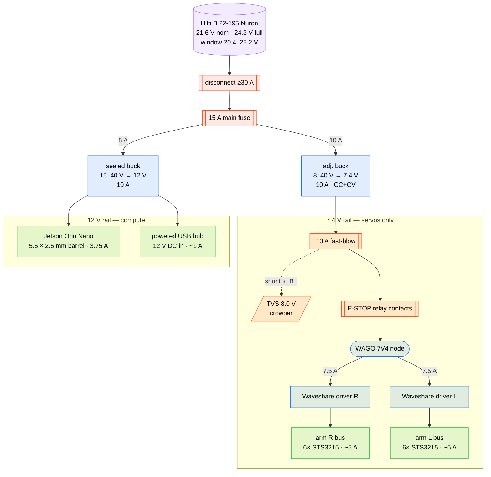
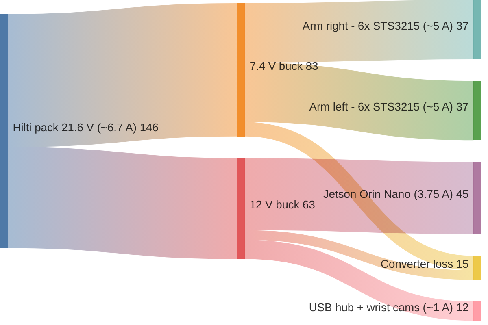
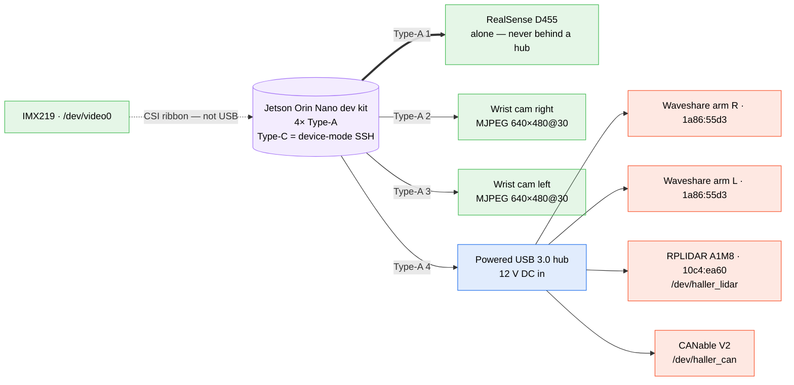
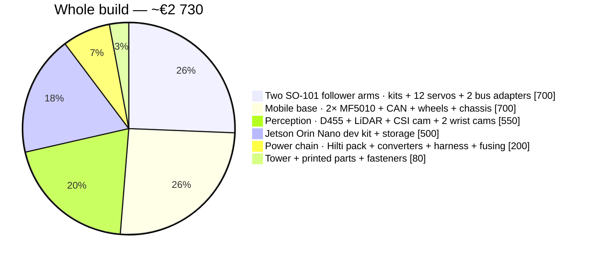

<Callout type="warn">
**Prices are estimates.** EUR, ex-shipping, mid-2026 European availability. They're good enough to budget from, not to reconcile accounts against. Lines marked ❌ are the only things not yet on hand.
</Callout>

Status key: ✅ on hand · ❌ to buy · ⏸️ deliberately deferred

Related: [`power_system.md`](https://github.com/oscardvs/haller_ws/blob/main/docs/power_system.md) derives the battery chain in depth; [`hardware_inventory.md`](https://github.com/oscardvs/haller_ws/blob/main/docs/hardware_inventory.md) tracks per-part provenance.

## Compute

| Item | Qty | Status | Notes |
|---|---|---|---|
| NVIDIA Jetson Orin Nano (8 GB dev kit) | 1 | ✅ | Main on-board compute. 8 GB variant required — the vision pipeline (YOLOv8n + SegFormer-B0, TensorRT FP16) won't fit in 4 GB. DC jack is **5.5 × 2.5 mm**, 9–20 V. |
| **NVMe SSD 512 GB** (M.2, dev-kit slot) | 1 | ✅ | Boot media. |
| USB-C power supply (≥45 W) | 1 | ✅ | Bench bring-up before the battery is in the loop. |

## Arms (SO-101, bimanual)

The two arms are **mechanically identical** — 6× C001-spec (1/345) STS3215 each,
rather than the stock leader gearbox mix of 3× C046 / 2× C044 / 1× C001. That
was a deliberate choice: symmetric hardware means either arm can play either
role, and swapping the end-effector flips it.

Both are currently **driven as followers**, because teleoperation is
[human-pose teleop](/docs/hmi/human-teleop) from a webcam — shipped, and free.
The left arm also keeps its teleoperator calibration from the May leader-follower
bring-up, so that mode is still available without buying anything.

| Item | Qty | Status | Notes |
|---|---|---|---|
| SO-ARM101 mechanical kit (FDM-printed + fasteners + bearings) | 2 | ✅ | Two followers, not follower + leader. Source: [TheRobotStudio/SO-ARM100](https://github.com/TheRobotStudio/SO-ARM100). |
| Feetech **STS3215, 7.4 V, 19 kg·cm**, 360° magnetic encoder | 12 | ✅ | 6 per arm, €17.83 each. Operating range 6.0–7.4 V. Feeding these 12 V destroys all twelve. See [the arm power rail](#arm-power-rail-74-v). |
| Waveshare Serial Bus Servo Driver Board | 2 | ✅ | One per arm, USB ↔ TTL half-duplex. `1a86:55d3`. Jumpers on **B** (USB control path). Barrel jack is **DC5521 = 5.5 × 2.1 mm** — *different from the Jetson's 2.5 mm*. |
| 3-pin TTL daisy-chain cables | 10–12 | ✅ | 5 per arm to chain motors 1–6, plus the upstream link. |
| Soft fin-ray gripper fingers (TPU 95A) | 2 sets | ✅ | Printed from the [XLeRobot hardware repo](https://github.com/Vector-Wangel/XLeRobot/tree/main/hardware). |
| Spare STS3215, 7.4 V, **C001 (1:345)** | 1 | ❌ €26.15 | `shoulder_lift` carries the most load and is the one that fails. [AliExpress](https://de.aliexpress.com/item/1005012394954023.html) — select `Gear Ratio 1-345`. The ratio is a **paid option**: the €13 listings you'll find are 12 V or low-ratio variants, not C001. |

<Callout type="warn">
**These are the 19 kg·cm / 7.4 V servos, not the 30 kg·cm / 12 V ones.** Torque is roughly a third lower than the 12 V variant most SO-101 build logs assume. Gravity sag is more visible and payload is lower. Keep anything bolted to the wrist under ~40 g, and expect `shoulder_lift` to work hard at full extension.
</Callout>

## Stand

| Item | Qty | Status | Notes |
|---|---|---|---|
| XLeRobot tower + arm base plate | 1 | ✅ | Reused from the [XLeRobot](https://xlerobot.readthedocs.io/) design. The IKEA RÅSKOG cart, mecanum base, and head gimbal from that BOM are **not** used. |
| Arm mounting plates | 2 | ✅ | Part of the XLeRobot base plate. |

## Perception

| Item | Qty | Status | Notes |
|---|---|---|---|
| Intel RealSense **D455** | 1 | ✅ | Third-person workspace camera on the tower. 87° × 58° FOV covers the whole bimanual workspace from a fixed mount. Build librealsense with `-DFORCE_RSUSB_BACKEND=ON` to avoid kernel-module patching on JetPack. |
| D455 **fixed** mount | 1 | ✅ | Print `Gimbal_Pitch_Holder` from the XLeRobot hardware repo and bolt it rigid — see [why no gimbal](#deliberately-not-buying). |
| **ELP 0.3 MP USB camera module**, 32 × 32 mm UVC, MJPEG 640×480@60 | 2 | ❌ €47.02 | One per gripper, €23.51 each +€6.61 shipping. [AliExpress](https://de.aliexpress.com/item/1005011810535562.html) — official ELP store, 5.0★/338 sold. Select lens **L170 (FOV 142°)**: a wrist camera sits ~10 cm from the gripper, so a narrow lens sees only fingers. Native VGA (no downscaling) and MJPEG at 60 fps, double the required rate. Board size is fixed by the printed [`SO101_Wrist_Cam_Hex-Nut_Mount_32x32_UVC_Module`](https://github.com/TheRobotStudio/SO-ARM100/tree/main/Optional/SO101_Wrist_Cam_Hex-Nut_Mount_32x32_UVC_Module) — 4× M2 to the module, 2× M3×8 + hex nuts to the wrist, manual twist focus. **Ask the seller to confirm 32×32 not 26×26**: the title lists both and there is no size selector. Micro-USB on the board, so budget two micro-USB→A leads. Keep under 40 g. |
| Slamtec RPLIDAR A1M8 | 1 | ✅ | `/dev/haller_lidar`. `10c4:ea60`. Base subsystem. |
| IMX219 CSI camera | 1 | ✅ | `/dev/video0`, base navigation. Not yet intrinsically calibrated. |

## Mobile base

Not yet integrated — the arms currently sit on a static stand. Listed for completeness.

| Item | Qty | Status | Notes |
|---|---|---|---|
| LK-TECH MF5010 BLDC (integrated controller) | 2 | ✅ | Direct drive, no gearbox. CAN @ 1 Mbps. **Winding variant 10T vs 35T still unrecorded** — sets the whole current budget. |
| Drive wheels, ⌀100 mm | 2 | ✅ | Wheel radius 0.05 m, track 0.34 m — matches `motor_params.yaml`. |
| Passive rear caster | 1 | ✅ | 3-wheel differential drive: 2 driven front + 1 rear caster. |
| **CANable V2 USB-CAN FD adapter** | 1 | ✅ | → `/dev/haller_can`. Resolves the long-standing "is there a CAN adapter?" inventory gap — the hardware interface being a serial stub was a software state, not a missing part. |
| 22 AWG PTFE twisted pair, 10 m | 1 | ✅ | CAN bus wiring. |
| CAN termination resistor, 120 Ω | 1 | ❓ | Check whether the MF5010s ship with one built in before fitting a second. |
| Swivel casters, 3 inch | 4 | ✅ | Only 1 is needed for the 3-wheel layout; spares. |

## Power

Battery is the **Hilti B 22-195 Nuron** (6S3P, 21.6 V nominal, 9.0 Ah, 194.4 Wh),
measured at 24.3 V near full with **no tool handshake required**. Design window
is 20.4–25.2 V. Full derivation in [`power_system.md`](https://github.com/oscardvs/haller_ws/blob/main/docs/power_system.md).

Two independent converter rails, because servo current spikes must not sag the
Jetson (Phase B adds a third: the motors sit on the raw pack rail):

Two things the diagram doesn't draw: **B−** goes to a single star-ground WAGO
node in 14 AWG, and every converter and board return lands there — not on each
other. The Nuron **data wires (white + blue) are individually insulated and left
unconnected**; no tool handshake is needed to draw current.

The fast-blow fuse goes **between the buck and the TVS tap**, not after it — the
crowbar only works if the TVS's fault current has to pass through the fuse to
clear it. That's why the shunt in the diagram hangs off the downstream side.

### Load budget

Watts, at peak, with converter efficiency taken at 90%:

**~146 W at the pack, ~131 W of it useful.** The 15 A main fuse covers this with
wide headroom. Runtime at a realistic ~60 W
average: **~3 h**. When the base motors join the pack the peak goes to ~19 A, so
the main becomes **25 A** and the motors get their own **20 A** branch — a motor
fault then clears locally instead of dropping the arms and the Jetson with it.

### Arm power rail (7.4 V)

| Item | Qty | Status | Notes |
|---|---|---|---|
| **XY6020L** digital buck, 6–70 V in → 0–60 V out, 20 A / 1200 W, CC+CV | 1 | ❌ €24.83 | Set to **7.40 V / 10.0 A CC**, both keyed in and stored in memory. [AliExpress — take the base-plate/cased variant](https://de.aliexpress.com/item/1005008144889470.html), not the bare board. Budget alternative: [ZK-SJ20, 7–80 V → 1.4–79 V, 20 A, €7.61](https://de.aliexpress.com/item/1005007979446715.html) — but the trimpots come back with it. |
| **TVS diode, 8.0 V standoff** — SMBJ8.0A (SMD) or **P6KE9.1A** (DO-15 axial) | 1 | ❌ €2 | **The most important €2 in this build** — see below. Prefer the axial P6KE9.1A: this harness is wire-and-WAGO, and an SMD part needs pigtails soldered on first. **Not P6KE8.2A** — see the correction below. |
| Inline fuse holders (10–18 AWG, ATO/ATC) + ATO blade fuses (15 A main, 10 A arm-buck input, 10 A arm rail, 2× **7.5 A** per arm, 5 A Jetson) | 6 + set | ❌ €12 | Blade fuses are fast-acting by construction — no special "fast-blow" part needed for the crowbar. |
| **LA36M E-stop, 22 mm mushroom, 1NC** | 1 | ✅ | AC/DC 12–24 V. Drives the relay coil, **not** the arm current — see [the E-STOP wiring](https://github.com/oscardvs/haller_ws/blob/main/docs/wiring.md#6-e-stop). |
| 12 V 1-channel relay module (low-level trigger) | 3 | ✅ | The E-stop contactor. Contacts carry the 7.4 V rail; the button only breaks the ~70 mA coil supply, which makes the arrangement failsafe. |
| Wago-style lever connectors, 2/3/5 port | 90 | ✅ | Star-ground node and rail distribution. |
| DC barrel pigtails, 18 AWG / 7 A | ~6 | ⚠️ | **5.5 × 2.1 confirmed** (Waveshare). A second lot lists 2.1 in the title and 2.5 in the variant — *measure before plugging anything into the Jetson*. |
| Heat-shrink kit, 328 pc | 1 | ✅ | |
| **14 AWG silicone wire** | 2× (1 m red + 1 m black) | ❌ €7.94 | The only gauge not on hand. Main run + 7.4 V trunk + ground return. [Search](https://nl.aliexpress.com/w/wholesale-14awg-silicone-wire.html) — select 14 AWG, **buy two packs**: the §4 runs need ~1.5 m red and ~1 m black, so a single pack is short. |
| XT60 pigtail for the Hilti harness | 1 pair | ❌ €2.00 | Makes the Hilti pack and the 6S LiPo interchangeable. [Search](https://nl.aliexpress.com/w/wholesale-xt60-connector-pigtail-silicone-wire.html) — 2 pcs male + female, 14 AWG 10 cm silicone tails. Battery side is male by convention, so the harness takes the female. |

<Callout type="error">
**Crowbar the 7.4 V rail.** The gap between safe (7.4 V) and destructive (12 V) is
4.6 V. A knocked trimpot costs you twelve servos. Four mitigations, all of them:

1. Set the output and **verify with a multimeter into a dummy load** before any servo is connected.
2. **Lock the trimpot** — nail varnish or thread-lock over the screw.
3. Fit the **8.0 V TVS across the rail, downstream of the 10 A fuse**. If the output rises, the TVS conducts hard and blows the fuse before the servos see it.
4. Set the converter's **CC limit to ~10 A** so a bus fault current-limits instead of running away.

**The XY6020L retires 1, 2 and 4 as manual steps**: the voltage and the current
limit are both keyed in and stored, and its display makes verification
continuous rather than a one-off multimeter check. There is no pot to varnish
because there is no pot.

**3 still applies, unchanged.** A digital setpoint is not a fault mode — a
shorted high-side FET passes raw pack voltage to the servos regardless of what
the display says. The TVS and the fast-blow fuse are the only mitigations that
don't depend on the converter working, which is exactly why they're the ones
you can't skip.

Two things to confirm on arrival: that the module's **output-on-at-power-up**
setting is enabled, so the arms come back without a button press after an E-STOP
cycle, and that it has real airflow — 24 V → 7.4 V at 10 A is 74 W out.
</Callout>

<Callout type="error">
**Correction: P6KE8.2A is the wrong TVS and earlier revisions of this page
listed it.** It would conduct on a healthy rail.

The two series number their parts differently. **SMBJ**8.0A's number is the
*stand-off* voltage (8.0 V, breakdown 8.89–9.83 V). **P6KE**8.2A's number is the
*breakdown* voltage — its stand-off is only ~7.02 V, **below the 7.4 V rail**,
so it sits in leakage the moment the rail comes up, and its 7.79 V minimum
breakdown is close enough to nominal to nuisance-clear the 10 A fuse on ripple.

The through-hole part matching SMBJ8.0A's intent is **P6KE9.1A** (stand-off
≈7.78 V, breakdown 8.65–9.55 V). Confirm VRWM against your specific
manufacturer's datasheet before fitting.
</Callout>

<Callout type="warn">
**6 A blade fuses don't exist.** The standard ATO/ATC series is 1, 2, 3, 4, 5,
**7.5**, 10, 15, 20, 25, 30, 35, 40 A. The per-arm branches specified as 6 A
should be **7.5 A** — a 5 A blade sits exactly at each arm's ~5 A peak and will
nuisance-blow mid-episode.

The tradeoff to make deliberately: 7.5 A is marginally above the 18 AWG
pigtails' stated 7 A rating, so the fuse no longer strictly protects the wire.
18 AWG silicone in free air carries well beyond 7 A and that figure is a
connector rating rather than a conductor limit — but make the call knowingly.
</Callout>

<Callout type="warn">
**Voltage drop matters far more at 7.4 V than at 12 V.** The servo floor is 6.0 V,
so you have 1.4 V of headroom for the whole chain. Use **14 AWG** for the 7.4 V run,
keep it under 0.5 m, and mount the converter near the arms.

**DC5521 barrel jacks are rated ~5 A** — exactly where each arm sits at peak. They
warm up. For a permanent build, solder power directly to the Waveshare board's DC
input pads rather than relying on the barrel.
</Callout>

### Jetson rail (12 V)

| Item | Qty | Status | Notes |
|---|---|---|---|
| **RCNUN sealed buck-boost**, 8–40 V in, 12 V **10 A**, IP67 | 1 | ❌ €20.79 | Select `Color: 10A` / `8-40V` / `12V`. [AliExpress](https://de.aliexpress.com/item/32897068247.html) — 8–40 V hits the ≥40 V absolute-max requirement exactly, which is the row every cheaper candidate fails. Budget alternative: [WH 15–35 V → 12 V 10 A, €10.64](https://de.aliexpress.com/item/1005006630139887.html) — pure buck, publishes its input window per variant, but a 35 V ceiling. |
| LM2596 module | 5 | ✅ | On hand. **Not for the Jetson and not for the arms** (~2 A real, non-synchronous). Fine for bench aux under 1.5 A. |

<Callout type="warn">
**Don't buy the 5 A version of the 12 V converter.** The rail carries the Jetson
at 3.75 A *plus* the powered hub at ~1 A plus the E-stop relay coil — about
4.8 A. A 5 A part would sit at ~96% of rating continuously, which is a
thermal-shutdown design rather than a margin. The 10 A class costs a few euro
more. It doesn't enlarge the fault energy either: the 5 A fuse on the
converter's *input* still bounds that branch.
</Callout>

### Harness

| Item | Qty | Status | Notes |
|---|---|---|---|
| Hilti sliding battery connector | 1 | ✅ | 6 wires: 2× B+, 2× B−, white + blue data. **Bond each power pair** — a single contact halves the interface's current rating. |
| **6S LiPo 5200 mAh 80C, XT60** + 6S 40 A BMS | 1 | ✅ | Alternate pack. Same 20.4–25.2 V envelope as the Hilti, so the converter design is pack-agnostic. The Hilti stays primary: 194 Wh vs 115 Wh, integrated BMS, charger on hand. |
| Main disconnect switch ≥30 A | 1 | ❌ €3.82 | [Search](https://nl.aliexpress.com/w/wholesale-battery-isolator-switch.html) — the common cut-off switches are rated 100 A+, far past what's needed. **Check the form factor**: many clamp onto a battery *post* on one side. Pick a **two-stud** variant so ring terminals on 14 AWG land on both sides. |
| TVS 30 V + 2200 µF bulk electrolytic for the **motor** rail | 1 | ⏸️ €10 | BLDC regen protection. Arm servos don't regen — defer until the base is integrated. |
| ATO fuses, 25 A main + 20 A motor branch | 1 set | ⏸️ €2 | The Phase B uprate. Same holders. |

### Monitoring

| Item | Qty | Status | Notes |
|---|---|---|---|
| Digital battery capacity indicator, 8–100 V DC | 1 | ✅ | Two wires across the pack. Works on either battery. |
| 2–6S LiPo cell voltage monitor / alarm | 1 | ✅ | Needs balance taps — **works only with the LiPo**. The Hilti pack exposes no cell taps. |
| Seeed XIAO nRF52840 **Sense** | 2 | ✅ | Onboard 6-axis IMU (closes the `robot_localization` IMU gap) *and* an ADC for the `BatteryState` publisher via a 100 k/15 k divider. |

## USB topology

Eight devices eventually. The Orin Nano dev kit has 4× Type-A (the USB-C is
occupied by device-mode SSH).

The three camera ports are about **bandwidth isolation**; the hub branch is
serial devices with negligible bandwidth. The D455 on its own root is
non-negotiable — it fails intermittently behind a hub.

| Item | Qty | Status | Notes |
|---|---|---|---|
| Powered USB 3.0 hub, **7-port**, **12 V DC input** | 1 | ❌ €19.04 | The DC jack lets it run off the 12 V rail instead of a wall wart. [Search](https://nl.aliexpress.com/w/wholesale-powered-usb-3.0-hub-12v-dc.html) — measure the jack (2.1 vs 2.5 mm) and confirm polarity before feeding it from the rail. |
| Ferrite clamps, 5 pcs, 3.5–13 mm | 1 kit | ❌ €3.49 | [Search](https://nl.aliexpress.com/w/wholesale-ferrite-core-clamp-cable.html) — the size spread covers USB leads *and* the hub's DC cord. |
| Shielded USB cables ≤1.5 m | — | ❌ ~€10 | Generic: 2× USB-A→C for the Waveshare boards, plus the CANable and LiDAR leads. Buy to the connectors you actually have. |

<Callout type="warn">
**The bandwidth trap.** Two 640×480@30 cameras in raw YUYV need ~147 Mbps *each*;
USB 2.0 delivers ~280 Mbps practical. Put both on one root and you get
`VIDIOC_STREAMON: No space left on device`. Buy cameras with **MJPEG** and force
MJPEG in the capture config — roughly 10× less bandwidth.

**`wrist_roll` is calibrated as continuous.** A USB cable routed through it will
wind up and snap. Clamp the range in software or leave a generous service loop
with strain relief at the wrist.

**Don't run USB alongside servo power** for long parallel stretches. The bus is a
half-duplex 1 Mbaud line sitting next to a switching converter.
</Callout>

## Teleoperation and data collection

**€0.** [Human-pose teleop](/docs/hmi/human-teleop) is shipped on `main`: in-browser
MediaPipe Pose + Hands → WebSocket → joint-angle retargeting → 60 Hz bimanual
control, with a selectable SPACE or mouth-open dead-man and per-side
pinch-to-gripper calibration. The
[HMI dataset recorder](/docs/data/dataset-collection) consumes that session
directly, so the chain from webcam to `LeRobotDataset` is already wired.

| Item | Qty | Status | Notes |
|---|---|---|---|
| Laptop webcam | 1 | ✅ | The operator-facing camera. Any UVC webcam works. |
| A dedicated leader arm | 0 | ⏸️ | Nothing to buy: the two arms are symmetric, so either can be the leader, and the left one is still calibrated as one. A *purpose-built* leader with the stock gearbox mix (3× C046 / 2× C044 / 1× C001) would cost ~€300 and only buys teleop ergonomics — worth revisiting if long sessions produce fatigue-degraded demonstrations. |
| Meta Quest headset | 0 | ⏸️ | Fallback if human-pose tracking quality proves inadequate. Borrowable rather than purchased. Prior art: [SO-101-VR-Control](https://github.com/kabilankb/SO-101-VR-Control) (browser WebXR, no app install, single-arm) and [lerobot_teleoperator_so101_vuer](https://github.com/Oasis-Uniandes/lerobot_teleoperator_so101_vuer). |
| Gamepad | 0 | ⏸️ | XLeRobot ships [Xbox / Joy-Con / keyboard teleop](https://xlerobot.readthedocs.io/en/latest/software/getting_started/XLeRobot_teleop.html) for real hardware. Backup input if webcam tracking degrades on a specific task. |

## Deliberately not buying

| Item | Why |
|---|---|
| **Head gimbal servos** (2× STS3215) + 3rd bus adapter | XLeRobot needs a pan/tilt head because it drives around a house. Our arms are on a fixed stand and the D455's 87° FOV already covers the workspace. An actuated head adds 2 DOF to the action space and a time-varying camera extrinsic. Every SO-101/ALOHA dataset that works uses a rigid third-person camera. Saves ~€45 and one USB device. |
| **Stepper motor for the camera** | There is no stepper in the XLeRobot design — the head is two STS3215 bus servos. Moot given the above. |
| IKEA RÅSKOG cart / mecanum base | Only the tower and arm base plate are reused; Haller has its own 3-wheel differential base. |
| Leader arms | See teleoperation above. |

## What's left to buy

Revised after auditing purchase records — the E-stop, relays, connectors,
heat-shrink, CAN adapter, boot SSD, and battery monitors were all already
bought.

| Item | ~€ | Blocking? |
|---|---|---|
| [XY6020L digital buck](https://de.aliexpress.com/item/1005008144889470.html) 6–70 V → 7.4 V, 20 A, CC+CV | 24.83 | **Yes** |
| [RCNUN sealed buck-boost](https://de.aliexpress.com/item/32897068247.html) 8–40 V → 12 V, 10 A | 20.79 | **Yes** |
| TVS 8.0 V (SMBJ8.0A) | 2 | **Yes** |
| Fuse holders + ATO fuses (15/10/10/6/6/5 A) | 12 | **Yes** |
| 14 AWG silicone wire, 2 packs | 7.94 | **Yes** |
| XT60 pigtail + main disconnect ≥30 A | 10 | **Yes** |
| TVS **P6KE9.1A**, 20 pcs axial | 2.02 | **Yes** |
| XT60 pigtail pair | 2.00 | **Yes** |
| Main disconnect, two-stud | 3.82 | **Yes** |
| **Blocking subtotal** | **~73** | |
| [ELP 0.3 MP 32 × 32 mm UVC camera](https://de.aliexpress.com/item/1005011810535562.html) ×2 | 47.02 | For multi-cam datasets |
| Powered USB hub, 7-port, 12 V input | 19.04 | For multi-cam datasets |
| Ferrite clamps ×5 | 3.49 | For multi-cam datasets |
| Shielded USB cables ≤1.5 m | ~10 *est.* | For multi-cam datasets |
| Spare STS3215 7.4 V **C001 (1:345)** | 26.15 | Insurance |
| **Total** | **~179** | |

Everything except the wrist cameras and the USB cables is a **quoted price as of
2026-08-01**, not an estimate. The total barely moved from the original ~€188,
but the composition did: the converters and the spare servo came in over
estimate, the wire, XT60, disconnect and hub came in under. Taking both
converter budget alternatives above brings the blocking subtotal to ~€55.

**[Phase B]** adds ~€12 when the base is integrated: the motor rail's TVS and
bulk capacitor, plus the 25 A / 20 A ATO fuses.

<Callout type="info">
**You can start recording before the cameras arrive.** The D455 alone, rigidly
mounted on the tower, is a complete single-camera observation. That path needs
none of the €118 below the blocking line — see
[dataset collection](/docs/data/dataset-collection).
</Callout>

## Cost ballpark (whole build, as configured)

Arms and base are half the build between them, and the base isn't integrated
yet — the ~€2 030 already standing is what does the manipulation work.

## Tools

- ✅ USB soldering iron kit (battery harness, fuse holders, E-stop pigtails)
- ✅ Bolt assortment M2–M4, brass heat-set inserts M2–M6, heat-shrink kit
- **Multimeter** — mandatory, not optional, for the 7.4 V rail
- Bench DC supply (≥30 V / ≥5 A) for first power-on before the battery is in the loop
- M2.5 / M3 hex keys, JIS Phillips (some servo horns)
- Wire strippers, ferrule crimper, zip ties
- USB data cable for JetPack flashing

## Wiring

Point-to-point wiring, fusing, grounding, E-STOP, and the bring-up procedure
live in [`docs/wiring.md`](https://github.com/oscardvs/haller_ws/blob/main/docs/wiring.md).

## Open items

- Measure the second lot of DC barrel pigtails — 5.5 × 2.1 or 2.5? The Jetson needs 2.5.
- Confirm the Waveshare board passes barrel voltage straight through to the servo bus rather than regulating it.
- MF5010 winding variant — 10T or 35T? Sets the base current budget.
- MCF302CB controller input voltage range.
- The `/dev/ttyUSB0` collision between the LiDAR and the motor interface — resolve with udev symlinks.
- Total robot mass — needed to quantify direct-drive grade and acceleration.
- CAD links for chassis plates and motor mounts.
- Camera intrinsic calibration (D455 + IMX219).

*Resolved by the purchase-record audit:* USB-CAN adapter exists (CANable V2) ·
boot media is a 512 GB NVMe · an IMU exists (XIAO nRF52840 Sense).
