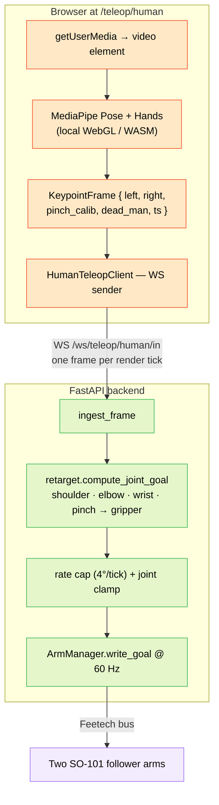

Human-pose teleop turns a laptop webcam into a bimanual leader for the two SO-101 arms. The browser runs MediaPipe Pose + Hands locally on every video frame, sends keypoints over a WebSocket, the backend retargets them to joint angles, and writes goals to both arms at 60 Hz. There is no physical leader arm; your body is the leader.

This mode is **mutually exclusive** with [leader↔follower teleop](/docs/hmi/teleop) — only one teleop kind runs at a time across the whole HMI.

<Callout type="info">
**Status (2026-05-23).** Shipped on `main`. Open palm + pinch calibration, SPACE dead-man, per-side tracking-loss handling, WS disconnect grace, mutual exclusion, and end-to-end smoke tests are all working. One known follow-up: the skeleton overlay on the camera feed currently renders blank in some browsers — fix tracked separately.
</Callout>

## How to drive

1. Open the dashboard, click the **Human teleop** link → routes to `/teleop/human`.
2. **Assign** the two arms. The default mapping is *your left hand → left arm, your right hand → right arm*. The `swap` toggle flips it (useful if the camera is mirrored or you're standing the wrong way around).
3. **Pinch calibration — per side.**
   - Hold your hand **open** in front of the camera, click **open · capture**.
   - Touch thumb and index together (full pinch), click **pinch · capture**.
   - Repeat for the other hand.
   These two distances per side become the gripper-aperture mapping: open = max gripper, pinch = closed.
4. **Frame yourself** so both shoulders and both hands are visible. The HUD shows live tracking per side; the skeleton overlay (when working) draws on the feed.
5. **Hold SPACE.** Goals start flowing to the arms; both flip to a `TELEOP · HUMAN` state. Move your arms; the SO-101s track 1:1.
6. **Release SPACE.** Both arms freeze in place within one control tick (~16 ms).
7. **Stop** ends the session entirely and restores both arms to MANUAL.

The dead-man (SPACE) is the safety primitive. While SPACE is up, the backend retargets and tracks state but does **not** write goals — the arms hold whatever pose they reached last.

## What's actually running

Three pieces, in order from camera to motor:



The browser does **all** the perception. MediaPipe runs on WebGL/WASM locally; the backend only ever sees keypoint coordinates, never raw video. That keeps the wire skinny enough for 60 Hz over any decent network and means the HMI doesn't need a GPU.

## State machine

The backend tracks an explicit human-teleop state. Visible in `/teleop/human` status.

```
IDLE  ── (start)        ──▶  ARMED
ARMED ── (first frame)  ──▶  TRACKING
TRACKING ──◀ (SPACE up) ──▶  DRIVING    ◀── (SPACE down)
any   ── (stop / E-STOP)──▶  IDLE
```

- **IDLE** — no session.
- **ARMED** — session started, waiting for the first keypoint frame.
- **TRACKING** — frames arriving, retargeting working, but SPACE is up so no goals are written. Safe to position yourself.
- **DRIVING** — SPACE is down. Goals flow to both arms.

Releasing SPACE drops you back to TRACKING within one control tick. The arms freeze; the next press resumes from the current pose.

## Safety and edge cases

### Mutual exclusion

Starting human teleop while leader/follower teleop is running returns **409**. Same in the other direction. The HMI also disables joint sliders, Home, and preset replay on participating arms for the duration of any teleop session.

### Tracking loss (per side)

If one hand exits the frame for longer than the per-frame staleness threshold (default 300 ms), **that arm freezes in place**. The other arm continues. The HUD shows `tracking lost (left)` or `tracking lost (right)`. As soon as the hand reappears in-frame, that arm resumes from its frozen pose.

This is deliberately per-side rather than global — common case is one hand briefly drops out of frame while you reach for something, and stopping both arms in that case would be jarring.

### WebSocket disconnect

If the keypoint WebSocket drops, the backend enters a **5 s grace window**. Frames already queued continue to drive the arms; new frames are missing. If the WS reconnects within the window (browser client reconnects automatically after 50 ms), the session resumes seamlessly. If 5 s elapses with no frames, the session transitions to IDLE and torque drops.

### Rate cap

Even with the dead-man down, per-tick joint motion is capped at **4° per control tick** (so ~240°/s at 60 Hz). This rules out catastrophic snap-to-goal motion if a frame's keypoints are wildly wrong — the arm at most lurches one tick's worth before the next frame corrects it.

### E-STOP

The global E-STOP (top-right of every page) stops human teleop before disabling torque on all arms, and zeros `/cmd_vel`. Same semantics as for leader/follower teleop.

### SPACE released

The dead-man is the primary stop. Release SPACE; both arms freeze within ~16 ms; no torque change; press SPACE again to resume from the frozen pose. This is the path you take for "let me reposition my body."

## Side swap

Click the **swap** button (or `POST /teleop/human/swap { swap: true }`) at any time during a session to flip the human-side ↔ robot-arm assignment. The retarget pipeline mirrors keypoints accordingly. Useful when the camera is mirrored (most laptop webcams are) or when you've physically swapped which arm is which.

## Calibration: open + pinch (per side)

The gripper aperture maps thumb↔index distance (in normalized webcam-space metres) to gripper degrees. Each side has its own calibration:

| Capture | What it measures |
|---|---|
| `open` | Distance with the hand visibly open. Becomes "gripper = max." |
| `pinch` | Distance with thumb and index fully touching. Becomes "gripper = 0." |

Defaults are `min_m: 0.02, max_m: 0.18` if you skip calibration entirely, which works on most setups but won't be tight. Always calibrate per side per session — the values depend on your distance from the camera, FOV, and hand size.

Recalibrate at any time by clicking the capture buttons again; the new values take effect on the next frame.

## REST + WebSocket surface

| Method | Path | Notes |
|---|---|---|
| GET | `/teleop/human` | Current status: state, configured arms, swap, pinch calib, per-side tracking-loss flags. |
| POST | `/teleop/human/start` | `{ left_arm, right_arm, swap, hz? }` — starts the session. 409 if leader/follower is running. |
| POST | `/teleop/human/stop` | Ends the session and restores both arms to MANUAL. |
| POST | `/teleop/human/swap` | `{ swap }` — flips the human-side ↔ robot-arm mapping. |
| POST | `/teleop/human/calibrate` | `{ left?: {min_m, max_m}, right?: {min_m, max_m} }` — set the per-side pinch range. |
| WS | `/ws/teleop/human/in` | Keypoint frames from the browser pose pipeline (one per render tick). |

A keypoint frame looks like:

```json
{
  "ts_ms": 1716470000000,
  "dead_man": true,
  "left":  { "wrist": [x, y, z], "elbow": [...], "shoulder": [...], "pinch_m": 0.05 },
  "right": { "wrist": [...], "elbow": [...], "shoulder": [...], "pinch_m": 0.18 },
  "pinch_calib": { "left": {"min_m": 0.02, "max_m": 0.18}, "right": {...} }
}
```

Backend ingestion is fault-tolerant: a single malformed frame is logged and dropped; the socket stays open.

## Manual smoke tests

A regression-suite-by-hand for after any change to the human-teleop stack. Run these on a real laptop with both arms wired:

1. **Cold start with no camera.** Browser permission prompt → deny → error state → no robot motion. Re-grant permission → recovers without restart.
2. **Calibrate pinch, engage SPACE, wave one arm.** Other arm stays in place. Gripper of the moving arm tracks open/closed crisply.
3. **Mid-drive: one hand exits the frame.** That arm freezes; other continues; chip turns amber; HUD reads `tracking lost (side)`. Bring the hand back in → resumes within ~300 ms.
4. **Mid-drive: release SPACE.** Both arms freeze within ~16 ms (one tick). State drops from DRIVING to TRACKING.
5. **Global E-STOP while driving.** Session stops, torque drops on both arms, E-STOP banner appears, `/cmd_vel` zeros. Recover with the E-STOP clear.
6. **Try to start leader↔follower while human teleop is running.** Returns 409; no state change to either session.
7. **Browser tab closes mid-drive (without clicking Stop).** WS drops; backend enters 5 s grace window; after grace, session → IDLE and torque drops on both arms.

## Design reference

Full design spec: [`docs/superpowers/specs/2026-05-22-human-pose-teleop-design.md`](https://github.com/oscardvs/haller_ws/blob/main/docs/superpowers/specs/2026-05-22-human-pose-teleop-design.md). The implementation lives across:

- Backend: `hmi/backend/haller_hmi/human_teleop.py` (session), `retarget.py` (keypoints → joint goals), routes in `server.py`.
- Frontend: `hmi/frontend/app/teleop/human/page.tsx` (route), `components/HumanTeleopPanel.tsx` (orchestrator), `CameraOverlay.tsx`, `PinchCalibrationStep.tsx`, `ScopeBar.tsx`, `DeadManIndicator.tsx`, `lib/humanTeleopClient.ts`, `lib/mediapipe.ts`.
