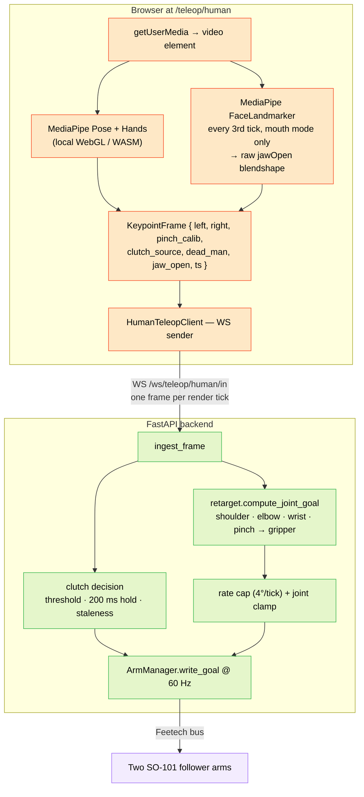

Human-pose teleop turns a laptop webcam into a bimanual leader for the two SO-101 arms. The browser runs MediaPipe Pose + Hands locally on every video frame, sends keypoints over a WebSocket, the backend retargets them to joint angles, and writes goals to both arms at 60 Hz. There is no physical leader arm; your body is the leader.

This mode is **mutually exclusive** with [leader↔follower teleop](/docs/hmi/teleop) — only one teleop kind runs at a time across the whole HMI.

<Callout type="info">
**Status (2026-07-28).** Shipped on `main`. Open palm + pinch calibration, per-side tracking-loss handling, WS disconnect grace, mutual exclusion, and end-to-end smoke tests are all working. The dead-man clutch now has **two selectable sources** — the SPACE key or a sustained mouth-open — chosen before the session starts.
</Callout>

## How to drive

1. Open the dashboard, click the **Human teleop** link → routes to `/teleop/human`.
2. **Assign** the two arms. The default mapping is *your left hand → left arm, your right hand → right arm*. The `swap` toggle flips it (useful if the camera is mirrored or you're standing the wrong way around).
3. **Pick the clutch source** with the `clutch: …` button — `spacebar` (default) or `mouth`. It cannot be changed once a session is running; see [Dead-man clutch](#dead-man-clutch) below.
4. **Pinch calibration — per side.**
   - Hold your hand **open** in front of the camera, click **open · capture**.
   - Touch thumb and index together (full pinch), click **pinch · capture**.
   - Repeat for the other hand.
   These two distances per side become the gripper-aperture mapping: open = max gripper, pinch = closed.
5. In mouth mode, **calibrate the mouth** as well — two capture windows, described under [Calibration: talk + open](#calibration-talk--open). The session refuses to start without it.
6. **Frame yourself** so both shoulders and both hands are visible. The HUD shows live tracking per side; the skeleton overlay draws on the feed.
7. **Engage the clutch** — hold SPACE, or open your mouth deliberately and hold it. Goals start flowing to the arms; both flip to a `TELEOP · HUMAN` state. Move your arms; the SO-101s track 1:1.
8. **Release it.** Both arms freeze in place within one control tick (~16 ms).
9. **Stop** ends the session entirely and restores both arms to MANUAL.

The dead-man clutch is the safety primitive, whichever source is armed. While it is released, the backend retargets and tracks state but does **not** write goals — the arms hold whatever pose they reached last.

## What's actually running

Three pieces, in order from camera to motor:



The browser does **all** the perception. MediaPipe runs on WebGL/WASM locally; the backend only ever sees keypoint coordinates, never raw video. That keeps the wire skinny enough for 60 Hz over any decent network and means the HMI doesn't need a GPU.

The browser **measures**; the backend **decides**. `jaw_open` goes over the wire as a raw blendshape score — the browser never reports whether that score should engage anything. The threshold, the hold timer, and the staleness fail-safe all run backend-side, next to the confidence floor, the tracking-loss gate, and the joint clamps. A browser that gets throttled in a background tab, starved of GPU, or blocked by a long task goes *silent*, and silence is what a dead-man has to read conservatively. A stuck `true` from a frozen tab must never be able to hold the arms open.

## State machine

The backend tracks an explicit human-teleop state. Visible in `/teleop/human` status.

```
IDLE  ── (start)          ──▶  ARMED
ARMED ── (first frame)    ──▶  TRACKING
TRACKING ──◀ (clutch out) ──▶  DRIVING    ◀── (clutch in)
any   ── (stop / E-STOP)  ──▶  IDLE
```

- **IDLE** — no session.
- **ARMED** — session started, waiting for the first keypoint frame.
- **TRACKING** — frames arriving, retargeting working, but the clutch is released so no goals are written. Safe to position yourself.
- **DRIVING** — the clutch is engaged. Goals flow to both arms.

Releasing the clutch drops you back to TRACKING within one control tick. The arms freeze; the next engage resumes from the current pose. Which source can engage it is fixed for the session — the state machine itself does not care where the signal came from.

## Dead-man clutch

One clutch is armed per session, chosen before it starts, and it is the **sole authority for that whole session**. The browser cannot hand authority to the other source mid-run: a frame speaking for the source that does not hold authority disengages the arms rather than taking them over.

| Source | Engage | Why you would pick it |
|---|---|---|
| `spacebar` (default) | Hold SPACE | Unambiguous, zero calibration, nothing to tune. |
| `mouth` | Open your mouth deliberately and hold it | Leaves **both hands free and in frame**. Reaching for a key takes a hand out of view, angles it away, and MediaPipe drops that whole side — which is the ordinary cause of one arm freezing mid-session. |

### Engage and release are not symmetric

Deliberately, because their consequences are not:

| Direction | Rule |
|---|---|
| **Engage** | `jaw_open ≥ t_engage`, sustained **200 ms continuously** across real observed samples. |
| **Release** | `jaw_open < t_release` — **immediate**, no debounce, one sample is enough. |
| **Stale** | No real face sample for **250 ms** → immediate disengage. |

Engaging is slow and demanding; releasing is instant. `t_release` sits below `t_engage`, so a score hovering at the boundary cannot chatter the arms on and off. Every glitch, dropout, and ambiguity resolves toward *stopped* — the hold is measured between **observed** samples, so losing your face mid-hold accrues nothing rather than quietly completing it.

The face model runs on every third tracking tick (roughly one real sample per 100 ms) and only in mouth mode, so two frames in three legitimately carry `jaw_open: null`. The 250 ms staleness budget sits above that gap on purpose: normal decimation must not read as a fault, and a real dropout must.

### Every failure resolves to disengaged

| Condition | Result |
|---|---|
| No face detected | Stale at 250 ms → disengage |
| Score below `t_release` | Immediate disengage |
| Mouth mode with no valid calibration | `start` refused (400); the clutch can never engage |
| A frame asserting the other source | Forced disengage; authority never hands over; `reason: "source_mismatch"` |
| WS disconnect | Existing 5 s grace window, then auto-stop |
| Backend restart | The clutch defaults to released |

### Calibration: talk + open

A hardcoded threshold cannot work — jaw geometry and speaking style vary too much, and the entire safety argument rests on the gap between *your* speech and *your* deliberate open. Two capture windows, mirroring the pinch calibration:

| Capture | What to do | What is recorded |
|---|---|---|
| `talk` | Start the window, speak normally for a few seconds, stop it. | The **maximum** `jaw_open` your speech reached — the noise floor that must never engage. |
| `open` | Start the window, hold a deliberate wide open, stop it. | The **minimum** value you sustained. |

Both are windows, not instants. Clicking once at some arbitrary moment during speech almost certainly misses the peak of your own speech envelope, which would place `t_engage` *below* the loudest thing your jaw actually does.

**Start each window already mid-gesture, not before it** — already speaking when you click `talk`, already holding the wide open when you click `open`. The window folds a running extreme from your very first sample, so clicking `open` on a closed mouth and opening *afterward* records that ramp-up as part of the minimum — typically ~0.05, which fails the separation check below with no visible cause. The card states this directly; it bears repeating here because it's the first thing an operator hits.

The backend derives both thresholds from those two raw numbers, at 60% and 30% of the calibrated gap. It refuses to produce thresholds at all when `open_min - talk_max` is under **0.25** — if your speech range overlaps your deliberate open there is no safe threshold to pick, so mouth mode declines to arm and says why. The card shows a `too close` warning at capture time, and `POST /teleop/human/start` returns **400** for the same reason, independently.

<Callout type="warn">
**Accepted risk — read this before using mouth mode on hardware.** Calibration defeats **speech**: normal talking does not reach a deliberate wide open, and the threshold is derived from the measured gap between the two.

It does **not** defeat a **yawn**. A yawn is wide, sustained past the 200 ms hold, and physically the same gesture as an intentional open. No threshold or debounce distinguishes them. **In mouth mode, yawning while the arms are live will engage them.**

This is a known and accepted cost of the approach, not an open bug. "Hardened" here means *speech-resistant*, and must not be read as *false-positive-free*.
</Callout>

### Why it will not engage

The clutch chip next to the camera feed prints the backend's reason whenever something is blocking, so "nothing is happening" is answerable from the page rather than a terminal.

| `reason` | Meaning |
|---|---|
| `engaged` | Driving. |
| `below_threshold` | Mouth closed, or below `t_release`. The resting state, not a fault — not printed. |
| `holding` | Above `t_engage`, still accumulating the 200 ms hold. |
| `stale` | No real face sample inside the 250 ms budget. |
| `uncalibrated` | No calibration, or one whose separation is under 0.25. |
| `spacebar_mode` | The spacebar holds authority; `jaw_open` is ignored entirely. |
| `source_mismatch` | A frame asserted the *other* source than the one this session started with. Force-disengaged; printed rather than silent, because the operator did something (or the browser sent something) unexpected. |

## Diagnostic readouts

Each joint's scope bar (the side panel next to the camera feed) carries two live values, not just the final commanded angle:

- **Ghost tick** — a thin marker showing what the retargeter *asked for* (`target`), separate from the solid fill showing what was actually *committed*. It only appears once the two diverge by more than 0.5°; most of the time target and committed coincide and there's nothing extra to see.
- **Reason badge** — appears beside the bar whenever a joint isn't tracking cleanly:

| Badge | Meaning |
|---|---|
| `CLAMPED` | The joint hit a calibrated limit. |
| `RATE-CAP` | The 4°/tick slew-rate cap is active — the commanded value is catching up to the target, not stuck. |
| `HELD` | Nothing is being commanded for this joint at all — either that side has no tracking yet, or its confidence has dropped below the 0.4 floor (see below) and it has stopped driving entirely. |

A joint with no badge is tracking normally — commanding exactly what the retargeter asked for.

Each side's pinch-calibration card also shows a `conf` readout — MediaPipe's tracking confidence for that hand, `[0,1]`. It turns amber below `0.5`, a warning ahead of the hard `0.4` cutoff below which that side stops driving entirely (every joint on it reports `HELD` until confidence recovers).

## Safety and edge cases

### Mutual exclusion

Starting human teleop while leader/follower teleop is running returns **409**. Same in the other direction. The HMI also disables joint sliders, Home, and preset replay on participating arms for the duration of any teleop session.

### Tracking loss (per side)

If one hand exits the frame for longer than the per-frame staleness threshold (default 300 ms), **that arm freezes in place**. The other arm continues. The HUD shows `tracking lost (left)` or `tracking lost (right)`. As soon as the hand reappears in-frame, that arm resumes from its frozen pose.

This is deliberately per-side rather than global — common case is one hand briefly drops out of frame while you reach for something, and stopping both arms in that case would be jarring.

### WebSocket disconnect

If the keypoint WebSocket drops, the backend enters a **5 s grace window**. Frames already queued continue to drive the arms; new frames are missing. If the WS reconnects within the window (browser client reconnects automatically after 50 ms), the session resumes seamlessly. If 5 s elapses with no frames, the session transitions to IDLE and torque drops.

### Rate cap

Even with the dead-man engaged, per-tick joint motion is capped at **4° per control tick** (so ~240°/s at 60 Hz). This rules out catastrophic snap-to-goal motion if a frame's keypoints are wildly wrong — the arm at most lurches one tick's worth before the next frame corrects it.

### E-STOP

The global E-STOP (top-right of every page) stops human teleop before disabling torque on all arms, and zeros `/cmd_vel`. Same semantics as for leader/follower teleop.

### Clutch released

The dead-man is the primary stop. Release it — SPACE up, or mouth closed — and both arms freeze within ~16 ms; no torque change; engage again to resume from the frozen pose. This is the path you take for "let me reposition my body."

In mouth mode the release is the fast direction by design: one sample below `t_release` disengages, with no hold to satisfy and no debounce to wait out.

## Side swap

Click the **swap** button (or `POST /teleop/human/swap { swap: true }`) at any time during a session to flip the human-side ↔ robot-arm assignment. The retarget pipeline mirrors keypoints accordingly. Useful when the camera is mirrored (most laptop webcams are) or when you've physically swapped which arm is which.

## Calibration: open + pinch (per side)

The gripper aperture maps thumb↔index distance (in normalized webcam-space metres) to gripper degrees. Each side has its own calibration:

| Capture | What it measures |
|---|---|
| `open` | Distance with the hand visibly open. Becomes "gripper = max." |
| `pinch` | Distance with thumb and index fully touching. Becomes "gripper = 0." |

Defaults are `min_m: 0.02, max_m: 0.18` if you skip calibration entirely, which works on most setups but won't be tight. Always calibrate per side per session — the values depend on your distance from the camera, FOV, and hand size.

Recalibrate at any time by clicking the capture buttons again; the new values take effect on the next frame.

## REST + WebSocket surface

| Method | Path | Notes |
|---|---|---|
| GET | `/teleop/human` | Current status: state, configured arms, swap, pinch calib, per-side tracking-loss flags, and the `clutch` block. |
| POST | `/teleop/human/start` | `{ left_arm, right_arm, swap, hz?, clutch_source? }` — starts the session. `clutch_source` is `"spacebar"` (default) or `"mouth"`; anything else is 422. 400 if mouth mode has no valid calibration. 409 if leader/follower is running. |
| POST | `/teleop/human/stop` | Ends the session and restores both arms to MANUAL. |
| POST | `/teleop/human/swap` | `{ swap }` — flips the human-side ↔ robot-arm mapping. |
| POST | `/teleop/human/calibrate` | `{ left?: {min_m, max_m}, right?: {min_m, max_m}, mouth?: {talk_max, open_min} }` — set the per-side pinch range and the jaw-open calibration. |
| WS | `/ws/teleop/human/in` | Keypoint frames from the browser pose pipeline (one per render tick). |

A keypoint frame looks like:

```json
{
  "ts_ms": 1716470000000,
  "clutch_source": "mouth",
  "dead_man": false,
  "jaw_open": 0.62,
  "mouth_calib": { "talk_max": 0.18, "open_min": 0.71 },
  "left":  { "wrist": [x, y, z], "elbow": [...], "shoulder": [...], "pinch_m": 0.05 },
  "right": { "wrist": [...], "elbow": [...], "shoulder": [...], "pinch_m": 0.18 },
  "pinch_calib": { "left": {"min_m": 0.02, "max_m": 0.18}, "right": {...} }
}
```

- `clutch_source` is what the browser *believes* is armed. It cannot reassign authority — the session's source is whatever `start` was told — and a mismatch disengages.
- `dead_man` is always the raw SPACE key state, whichever source is armed. It never means "engaged".
- `jaw_open` is the raw `jawOpen` blendshape score in `[0,1]`, or `null` on ticks where the face model did not run (two in three) or found no face. It is never a decision.
- `mouth_calib` is only honoured in a mouth-mode session; a spacebar session cannot be handed a mouth clutch through frame data.

`GET /teleop/human` answers with a `clutch` block alongside the existing ones. `goal_deg` is unchanged — the dataset recorder reads it as the `action` column:

```json
{"source": "mouth", "jaw_open": 0.62, "t_engage": 0.50, "t_release": 0.34,
 "engaged": true, "stale": false, "reason": "engaged"}
```

`engaged` and `reason` are the values the last ingested frame produced; `stale` is computed live on every poll, so a face that stopped being seen reads as stale from a status read alone.

Backend ingestion is fault-tolerant: a single malformed frame is logged and dropped; the socket stays open.

## Manual smoke tests

A regression-suite-by-hand for after any change to the human-teleop stack. Run these on a real laptop with both arms wired:

1. **Cold start with no camera.** Browser permission prompt → deny → error state → no robot motion. Re-grant permission → recovers without restart.
2. **Calibrate pinch, engage SPACE, wave one arm.** Other arm stays in place. Gripper of the moving arm tracks open/closed crisply.
3. **Mid-drive: one hand exits the frame.** That arm freezes; other continues; chip turns amber; HUD reads `tracking lost (side)`. Bring the hand back in → resumes within ~300 ms.
4. **Mid-drive: release SPACE.** Both arms freeze within ~16 ms (one tick). State drops from DRIVING to TRACKING.
5. **Mouth mode, the whole sequence.** Calibrate `talk` and `open`; confirm no `too close` warning. Start, raise both hands, open your mouth — the arms engage only after a deliberate sustained open, not the instant your jaw moves. Close it; they stop immediately. Then **speak a normal sentence and confirm the arms do not engage** — that is the entire safety argument for the feature. If speech engages them, re-capture `talk` while speaking more loudly and variedly, and do not run it on hardware until it holds.
6. **Mouth mode, face lost mid-hold.** Start opening your mouth, then turn away or cover the camera before the 200 ms hold completes. The arms must **not** engage, and the chip must read `(stale)` — a fault may never be what starts the arms.
7. **Mouth mode, bad calibration refused.** Capture `talk` and `open` close together and click start. Expected: refused with a message about calibration; no session starts.
8. **Global E-STOP while driving.** Session stops, torque drops on both arms, E-STOP banner appears, `/cmd_vel` zeros. Recover with the E-STOP clear.
9. **Try to start leader↔follower while human teleop is running.** Returns 409; no state change to either session.
10. **Browser tab closes mid-drive (without clicking Stop).** WS drops; backend enters 5 s grace window; after grace, session → IDLE and torque drops on both arms.

## Design reference

Full design spec: [`docs/superpowers/specs/2026-05-22-human-pose-teleop-design.md`](https://github.com/oscardvs/haller_ws/blob/main/docs/superpowers/specs/2026-05-22-human-pose-teleop-design.md), and for the mouth clutch specifically [`docs/superpowers/specs/2026-07-28-mouth-dead-man-design.md`](https://github.com/oscardvs/haller_ws/blob/main/docs/superpowers/specs/2026-07-28-mouth-dead-man-design.md). The implementation lives across:

- Backend: `hmi/backend/haller_hmi/human_teleop.py` (session, hold timer, staleness), `safety.py` (the pure engage/release policy), `retarget.py` (keypoints → joint goals), routes in `server.py`.
- Frontend: `hmi/frontend/app/teleop/human/page.tsx` (route), `components/HumanTeleopPanel.tsx` (orchestrator), `CameraOverlay.tsx`, `PinchCalibrationStep.tsx`, `MouthClutchCalibration.tsx`, `ScopeBar.tsx`, `DeadManIndicator.tsx`, `lib/humanTeleopClient.ts`, `lib/mediapipe.ts`.
