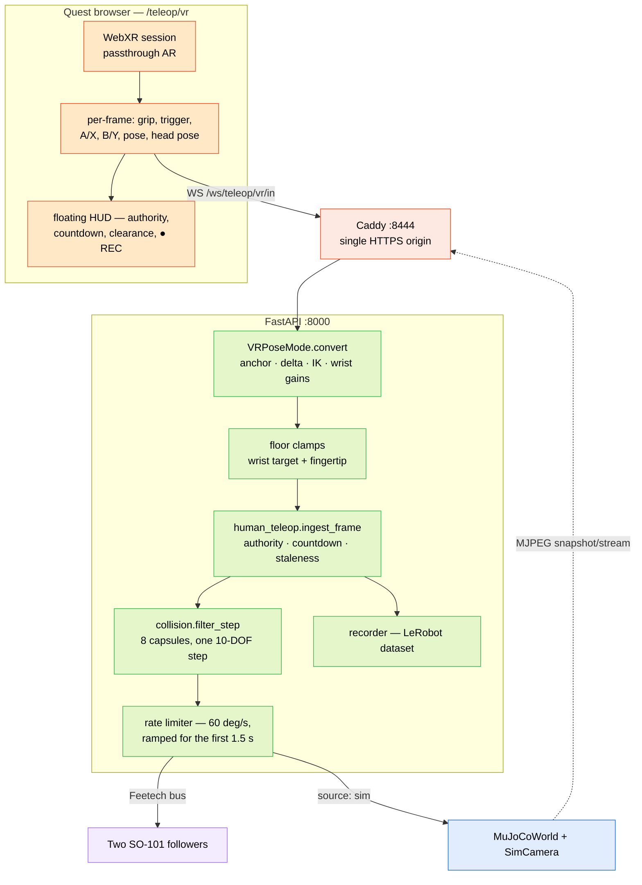

Quest VR teleop drives both SO-101 arms from a Meta Quest. You see the arms through passthrough (or, in sim, in a floating camera tile), each controller grip is that arm's dead-man, your hand's *movement* drives the gripper tip through IK on the robot's real kinematics, and a capsule model of both arms runs inside the 60 Hz commit loop so you cannot command them into each other or through the bench.

It is **mutually exclusive** with [human-pose teleop](/docs/hmi/human-teleop) and [leader↔follower teleop](/docs/hmi/teleop) — one teleop kind holds the arms at a time.

<Callout type="info">
**Status (2026-08-08).** Shipped on `main`. The full pipeline is exercised headlessly by `scripts/vr_smoke.py` — 38 checks against a live backend, including the record→save→files-on-disk round trip. The sim path (`up.sh --sim`) has been driven from the headset. What has **not** happened yet is a human driving the *real* arms from the headset: do the [first hardware run](#first-hardware-run) checklist before trusting mm-level margins, because the mount positions in the real configs are still the sim scene's ±0.20 m rather than a measured plate.
</Callout>

## Bring it up

Rehearse in sim first. It is the same page, the same HTTPS origin and the same backend code — only the arms are MuJoCo instead of Feetech, so nothing physical can move:

```bash
# desktop, repo root
scripts/quest-teleop/up.sh --sim     # MuJoCo bimanual, config.bimanual-sim.yaml
scripts/quest-teleop/up.sh --local   # real arms, backend on THIS desktop, no Jetson
scripts/quest-teleop/up.sh           # real arms, backend on the Jetson over ssh
scripts/quest-teleop/down.sh         # stop the desktop half
```

`up.sh` prints the URL to open **in the Quest browser**:

```
https://192.168.0.191:8444/teleop/vr
```

Accept the self-signed cert once, then press **Enter Passthrough**.

<Callout type="warn">
**It must be HTTPS, and it must be one origin.** `navigator.xr` is simply *absent* over plain http — no prompt, no error, just "WebXR is not available". And a page served from one origin cannot open a WebSocket to another without tripping mixed-content and CORS. That is the entire reason Caddy exists here: it fronts the Next.js dev server *and* the backend under a single `https://<desktop>:8444` origin, so the page at `/teleop/vr` and the socket at `/api/ws/teleop/vr/in` share it.
</Callout>

| piece | port | host | started by |
|---|---|---|---|
| FastAPI backend (arms, IK, guard, recorder) | 8000 | Jetson, or the desktop with `--sim` / `--local` | `up.sh` / `backend-jetson.sh` |
| Next.js frontend | 3001 | desktop | `up.sh` |
| Caddy — the single HTTPS origin | 8444 | desktop | `up.sh` (`scripts/quest-teleop/Caddyfile`) |

`NEXT_PUBLIC_BACKEND_URL` is inlined when the dev server **starts**, so changing the backend URL needs a frontend restart, not a reload.

## Controls

| input | effect |
|---|---|
| **left grip** (squeeze) | dead-man for the **left arm** only |
| **right grip** | dead-man for the **right arm** only |
| **trigger** (analog) | that arm's gripper — 0 open, 1 closed |
| **B or Y** (either controller) | **E-STOP** — torque off both arms, session stops |
| **hold A or X** (~0.5 s) | start, then stop-and-save, a dataset take |
| **left thumbstick click** | next camera view in the tile |
| **right thumbstick click** | next tile size (S → M → L) |
| release a grip | that arm freezes exactly where it is |
| headset off / Quest menu open | frames force-disengage; both arms freeze |

The menu bindings had to land on the thumbstick clicks: trigger, grip, A/X and B/Y are all spoken for, and every one of them is either a dead-man or a safety action, so none can be shared with a menu. They are edge-detected on press rather than hold-gated like A/X — picking a view is harmless, where a stray take boundary is corrupted data.

Discarding a take is deliberately **cockpit-only**: a thumb brush must never be able to throw away an episode you just drove.

## Architecture



`VRPoseMode` only ever *produces the target*. Everything downstream — the acquisition countdown, staleness, rate ramps, per-side authority, the collision guard, the recorder — is the same code the camera-based path uses. Position mode is a retargeter swap, not a parallel control stack.

## Position mode

The default, and the one to use. The legacy body-angle mode is still in the *hand mapping* selector, and it will fight you:

<Callout type="warn">
The SO-101 is nearly the opposite of a human arm. Its shoulder pitch **stops +10° below horizontal** while yours drops freely, and its elbow folds **downward** while yours folds up. Copying human joint angles onto that chain means a natural reach-down-and-grab either clamps against the pitch limit or asks you to bend your elbow backwards. That is not a tuning problem; it is the wrong mapping, and it is why position mode exists.
</Callout>

### Anchoring: the robot comes to you

Squeezing a grip **anchors**. At that instant the arm's current pose and your hand's current pose become a shared origin:

- The open-grip target is *wherever the arm already is*, so gate error is zero. The moment you squeeze, matching is already done and the 3 s countdown is the only wait — hold still, feel the buzz, drive.
- While the grip is held, hand deltas move the arm. Release **freezes** the arm where it is and drops the anchor.
- The next squeeze re-anchors from wherever your hand is then. Big workspaces are covered by **ratcheting**: drag, release, move your hand somewhere comfortable, squeeze, drag again.

No limb-length calibration is involved anywhere. That is the other half of the point — the angle-copying path needs a body model; this one needs nothing about your body at all.

### From hand delta to joint goal

The delta is taken in the operator's **anchored heading frame** — the direction you were facing when you squeezed, frozen for the life of the anchor, so turning your body mid-drag does not swing the arm.

| operator axis | arm base axis |
|---|---|
| right | `+x` |
| forward | `+y` |
| up | `+z` |

Both arms use the **same** mapping, because the mounts are identical and side-by-side rather than mirrored.

<Callout type="warn">
**Why these signs are not free to choose.** The operator frame `(right, forward, up)` is right-handed, so the robot axes it maps onto must form a right-handed triple too. `det[+x, +y, +z] = +1` — a rotation. Every axis reads true.

Forward used to map to `−y`, on the reasoning that the arm reaches `−y` at zero pan, so pushing your hand away ought to extend it. Paired with right → `+x` that is a **reflection**: `det[+x, −y, +z] = −1`. And a reflection cannot be fixed by moving the camera — from any viewpoint, exactly one axis comes out inverted. Viewed from the front it agreed on left/right and inverted *depth*: push your hand away and the gripper travelled toward you and down the frame. That is what "the view is mirrored" actually was, and it stayed hidden while the camera sat near eye level, because depth was too ambiguous there to read.

The operator — real, or watching the sim camera — stands in **front** of the bench facing the mounts. So their forward is `+y`, and their right is `cross(forward, up) = +x`. Spatial truth beats the kinematic intuition: the operator is position-controlling a gripper, not reasoning about which way the elbow folds.

Pinned by a determinant test, not by per-axis sign assertions, so it survives future rewrites of the individual signs. A second test requires the `threequarter` camera to see `+x` to frame-right and to look along `+y` — viewing the same scene from behind would flip left/right on screen while the mapping stayed put, which is the same bug wearing a different hat.
</Callout>

<Callout type="info">
**Do not mirror twice.** Frames from this mode carry `mirror_mode: "none"`. The joint goals are already in robot joint space, so letting the downstream handedness step run again applies mirroring twice — an arm that moves opposite your hand, or the wrong arm moving, with everything else looking correct.
</Callout>

The target wrist point goes through **damped least-squares IK** (`solve_wrist_point`) which owns `shoulder_pan`, `shoulder_lift` and `elbow_flex`:

- Numeric on purpose, run against the **same `fk_points`** the collision guard trusts, so there is exactly one definition of the kinematics in the codebase.
- 24 iterations max, finite-difference Jacobian (0.25° probe), a 20°-per-iteration step cap, and joint limits clamped on every iterate — an unreachable target converges to the closest reachable pose instead of diverging.
- Damping is **relative** to the Jacobian's own scale: 1% of the mean diagonal of `JᵀJ`. With links in metres and joints in degrees those entries sit around 1e-5, so an absolute lambda would either swamp them and freeze the solve or vanish entirely.
- ~30 FK evaluations per solve, per driven side, at 30 Hz: microseconds of numpy.

The wrist joints do **not** go through IK. They ride the controller's attitude relative to its anchored attitude, and they are deliberately **exaggerated**:

| gain | value | why |
|---|---|---|
| `WRIST_ROLL_GAIN` | **2.0** | A wrist holding a controller rolls comfortably through maybe ±90°; the SO-101's `wrist_roll` spans ±160°. At 1:1 the arm's roll extremes are unreachable without re-anchoring. |
| `WRIST_PITCH_GAIN` | **1.6** | Setting a cube down needs `wrist_flex` at or near its **+95° limit**. From the parked +10°, at 1:1 that asks for 85° of hand pitch — past what a hand on a controller will do, so the arm stops short of the bench and reads as a constrained joint. At 1.6 a ~53° hand pitch covers the same travel. Kept *below* the roll gain: pitch also drives the fingertip toward the floor clamp, and jitter here lands on the gripper 1.6-fold. |

The gripper is absolute, straight off the trigger — no anchoring, no gain.

## Keeping the arm off the bench

This is the subtle one, and it is worth understanding because the symptom looks nothing like the cause.

The collision guard scales back the **whole** commanded step. So if the IK target sits in a region where *every* direction makes the floor slack worse, the guard clamps everything — including the perfectly safe lateral motion in the same step. The arm goes **solid**: not "stops descending", but stops moving at all, which reads as a seized joint or a too-tight limit.

Pushing your hand below the bench does exactly that. Two clamps prevent it, both applied to the *target* before the guard ever sees it:

| clamp | value in sim | what it stops |
|---|---|---|
| wrist-point floor (`min_target_z`) | `table_z + wrist_min + 5 mm` = **0.02 m** | A hand pushed under the bench sinking the IK target below the guard's wrist floor. |
| fingertip floor (`min_tip_z`) | `table_z + tip_min + 5 mm` = **0.005 m** | The same freeze via the *tip*, which with a pitched-down hand hangs up to **10.5 cm** below the wrist — so clamping the wrist alone does not bound it. |

Clamping the target turns "pushed too low" into "**slides along the bench**", and leaves the guard's own floors as the precise backstop rather than the thing doing the work.

The fingertip clamp has to iterate: raising the wrist target re-pitches the forearm, which moves the tip slightly *less* than the correction. Up to **12 passes**, then it takes what it has — the guard is still behind it, so an unconverged last millimetre is safe, just not ideal.

`server.py` derives both floors from `cfg.collision` rather than hardcoding them, so a config whose bench sits at a different height gets the right clamp for free.

## The collision guard

`collision.py` sweeps **four capsules per arm** along an analytic FK of the vendored MJCF, and filters every commanded step.

| capsule | radius | covers |
|---|---|---|
| `column` | 50 mm | base block + `Rotation_Pitch` housing |
| `upper` | 35 mm | upper arm |
| `fore` | 35 mm | forearm |
| `hand` | 45 mm | `Wrist_Pitch_Roll` + both jaws |

Coarse is the point: capsule distance is exact, cheap enough for the 60 Hz loop with room for a bisection search, and **sound** as long as the capsules contain the meshes. `tests/sim/test_collision_sim.py` holds both properties honest against MuJoCo — the FK against body kinematics, and soundness by asserting that whenever MuJoCo finds an inter-arm contact, this model's gap is already ≤ 0.

The filtering rules:

- A step that keeps ≥ `margin_m` clearance **passes**.
- A step that *improves* a bad pose **always passes** — escape is never blocked.
- Anything else is scaled back along its own direction and stops **at** the margin.
- Both arms scale **together**. The commanded step is one 10-DOF motion; scaling its components independently could turn a safe diagonal into an unsafe slide.
- The **gripper never participates**. Opening the jaw moves nothing this model tracks, and freezing it because the *arms* are close would cost you a grasp for no safety gain.

| knob | default (real) | bimanual sim | note |
|---|---|---|---|
| `margin_m` | 25 mm | **15 mm** | Also absorbs calibration-zero offsets between the real arms and the MJCF convention. |
| `self_margin_m` | 8 mm | 8 mm | Same-arm pairs. A normal SO-101 pose runs its forearm within ~30 mm of its own column; the full margin would leave the guard permanently one step from clamping. |
| `tip_min_m` | 0 mm | 0 mm | Zero so the gripper can touch the surface it picks from. |
| `wrist_min_m` | 30 mm | **15 mm** | At 30 mm a level hand could not reach a 4 cm cube resting on the bench. |
| `elbow_min_m` | 20 mm | 20 mm | |
| `mounts` | ±0.20 m | ±0.20 m | **Placeholder on the real rig** — the sim scene's value, not a measured plate. |

With 45 mm hand capsules and the sim's 15 mm margin, the closest two fingertips get is **105 mm**. A direct cube-to-cube hand-off is therefore *not* possible; hand-offs go set-down-then-regrasp. The binding constraint there is the hand capsule radius, not the margin — dropping the margin further would not buy a hand-off.

When the guard bites you feel a light buzz and the HUD shows `◉ COLLISION HOLD`. `enabled: false` turns it off entirely, and the HUD says so.

## The sim arena

The bimanual sim config (`config.bimanual-sim.yaml`) composes a scene aimed squarely at pick-and-place data collection. See [MuJoCo simulation](/docs/sim/mujoco) for the preset machinery; the arena itself:

| element | geometry |
|---|---|
| workbench | 1.2 × 0.9 m box, top at `z=0`, mid grey |
| arena floor | plane flush with the bench underside (`z=-0.02`), darker |
| backdrop | 2.4 × 0.45 m at `y=+0.5` — **visual only**, `contype`/`conaffinity` 0 |
| place zone | 0.12 × 0.12 m blue pad at `(0, -0.21)`, 2 mm proud |
| cubes | 4 cm, one colour each, dealt into up to 5 measured slots (`sim_cubes`, 3 for bimanual) |
| lights | overhead at `(0,0,1.5)`; a **shadowless** operator-side fill at `(0,-1.1,0.75)` |

Three details are load-bearing rather than decorative:

- **The backdrop is non-physical on purpose.** If it ever gained collision geometry it would become a surface an arm could lean on — and one the guard, which knows only the floors in its config, has no idea about. A test pins `contype`/`conaffinity` at 0.
- **The arena floor catches escapees.** A cube swept off the bench used to accelerate away forever: a bad frame to record and a bad state to reset from.
- **The place zone sits at `y=-0.21`, not `-0.25`.** Landing a *fingertip* at bench level in the `-0.24…-0.27` band needs `wrist_flex` at or past its +95° hard limit — swept, both arms, the worst depth on the entire midline, and precisely where the task ends. At `-0.21` (~83% of reach) it needs ~75°, leaving the wrist somewhere to go.

The finger pads also run **slide friction 2.0**, where the vendored MJCF ships 1.0. Upstream tuned for bare PLA; the real pads are rubber TPU, and at 1.0 a pinched 4 cm cube slips out mid-transport. MuJoCo combines a contact pair by `max`, so this one value governs pad-cube friction on its own.

### Cameras

| camera | pose | fovy | reads well |
|---|---|---|---|
| `overhead` | `(0, 0, 1.0)` looking straight down | 60 | `shoulder_pan`, plan-view cube positions |
| `threequarter` | `(0, -0.88, 0.62)` → `(0, -0.12, 0.045)`, ~37° down | 50 | hand pitch, jaw-vs-cube alignment, height via shadow |

`threequarter` is listed **first** in the config, so it is what the cockpit's BASE tile and the headset HUD show, and it is the dataset's base camera. It is framed on the *workspace*, not on the arms' extremes: coverage is `|x| ≤ ~0.44 m` across the working depth band against cubes at ±0.28 m. A wide lateral swing past that clips at the frame edge — a deliberate trade, because the alternative (the near-eye-level framing it replaced) kept a 45° outward pan in frame, a pose that holds the gripper off the bench entirely, and spent ~60% of every *useful* frame on empty space.

Tests pin the framing: every cube slot, the place zone read from the model rather than restated, and both arm mounts inside the frustum, plus the downward aim.

## Recording datasets

The sim chain records the **same LeRobot datasets** the real rig will — same recorder, same schema — so headset hours produce training data with no arms powered.

1. **Draft the take on the desktop cockpit** (`/` → Dataset tab): the task string (one instruction per dataset, e.g. *"pick the red cube, hand it to the other arm, place it in the box"*) and your HF username. The draft persists in the browser, so the headset can start takes from it.
2. **Bring up sim**, open the URL in the Quest browser, Enter Passthrough.
3. **Hold A or X (~0.5 s)** to start — both controllers buzz, the HUD shows `● REC <frames>`. Drive the task. Hold A/X again to stop **and save**. Repeat per episode; the draft stays put.

Takes land in `~/.cache/huggingface/lerobot/<hf_user>/<task-slug>` at **30 fps, h264**:

| column | contents |
|---|---|
| `observation.state` / `action` | 12-dim, left-then-right SO-101 joint order |
| `observation.base` | base channel |
| `observation.wall_clock` | **real** capture time — LeRobot's own `timestamp` is synthetic |
| `observation.images.threequarter_sim` | operator view |
| `observation.images.overhead_sim` | plan view |

The `skipped` counter beside the frame count tells you a take had gaps; the wall-clock deltas tell you where. An **E-STOP mid-take is fine** — the recorder notices the session die and saves up to that frame instead of appending a torque-off tail.

`telemetry.hz` is **30** in the sim config, matched to the Quest's ~30 Hz publish rate and LeRobot's SO-101 convention, and it is therefore also the recorded fps. The real rig stays at **20 Hz**: the half-duplex Feetech bus already interleaves 60 Hz writes with those reads.

Replay a take onto the sim arms to eyeball what you actually drove (loops until stopped):

```bash
curl -X POST http://localhost:8000/teleop/sim/start \
  -H 'Content-Type: application/json' \
  -d '{"follower": "left", "leader": {"source": "replay",
       "dataset_path": "~/.cache/huggingface/lerobot/<hf_user>/<task-slug>"}}'
# ...and "follower": "right" for the other arm; /teleop/sim/stop to end.
```

## HUD and diagnostics

The HUD floats over passthrough: per-side authority and countdown, grip state, live collision clearance, a red `● REC <frames>` while a take rolls, an E-STOP button you can hit with the controller ray, and any backend error.

In sim the **camera tile floats in the HUD** and defaults on whenever the backend's base camera is a sim render — passthrough shows your room, and the sim arms live only in that tile. `Cam off` hides it. The desktop cockpit (`/`) shows the same view.

### The view menu

The HUD carries a menu block listing every camera the backend advertises, with the active one marked, the tile size, and the record command beside its live frame count. It is generic over `/cameras`: in sim that is the MuJoCo views, and on the real rig it is the mast plus the egocentric gripper cams, with no further work.

Both the chosen view and the tile size persist in `localStorage`, so a session resumes where the last one left off.

Tile size is the real lever on "the view is too small". The tile is a **quad in the world**, so apparent size is width ÷ distance, not pixels:

| size | width | ≈ horizontal field at the HUD's 1.15 m |
|---|---|---|
| S | 1.1 m | 51° |
| M | 1.6 m | 70° |
| L | 2.2 m | 76° |

Changing it rewrites the quad's model matrix in place — no pipeline rebuild, no reallocation.

<Callout type="info">
**Why the tile is soft, and the fix that is not in yet.** The Meta Quest Browser refuses the `dom-overlay` module on-device (it only works in Meta's desktop emulator), so the HUD falls back to a world-locked quad painted from a single 1024×768 canvas at ~10 Hz — with the camera image composited into the *same* canvas as all the status text, then resampled a second time through the eye framebuffer.

The right fix is **WebXR Layers**. An `XRQuadLayer` is composited by the runtime at its own resolution, so each pixel is sampled once; Meta measure GPU bus-busy dropping from 50.2% to 23.9% with quality preserved, and cite 8K@90fps video layers on a Quest 2. Two routes:

- `new XRWebGLBinding(session, gl).createQuadLayer({ space, viewPixelWidth, viewPixelHeight, transform, width, height })` — you render into it, which suits an MJPEG `` uploaded as a texture.
- `new XRMediaBinding(session).createQuadLayer(videoEl, { space, layout })` — the runtime owns the decode, but it needs a real `HTMLVideoElement`, which our MJPEG stream is not.

The catch, and why it is not in this change: `layers` and `baseLayer` are mutually exclusive in `updateRenderState`, so adopting layers means moving the primary scene onto an `XRProjectionLayer` as well. That is not a refactor to land untested against a headset. Request it as an optional feature and keep the present quad as the fallback.
</Callout>

| authority | meaning |
|---|---|
| `driving` | Grip held, anchor live, goals flowing. |
| `held` | Grip released, tracking lost, or frames starved — that arm is frozen where it is. |

Per-side is the whole design. One controller leaving the Quest's tracking volume releases **only that arm**; the other keeps driving, and re-tracking re-acquires through the normal countdown.

## REST + WebSocket surface

| Method | Path | Notes |
|---|---|---|
| WS | `/ws/teleop/vr/in` | WebXR frames from the headset, one per render tick. |
| GET | `/teleop/human` | Session status — state, per-side authority, `collision`, `goal_deg`, `joints` (target vs committed). |
| POST | `/teleop/human/start` | `{ left_arm, right_arm, swap, clutch_source: "vr_grip" }`. 409 if another teleop kind holds the arms. |
| POST | `/teleop/human/stop` | Ends the session, restores MANUAL. |
| POST | `/record/start` · `/record/stop` · `/record/status` | Dataset takes. |
| POST | `/estop` | Torque off both arms, stop the session, zero `/cmd_vel`. |
| GET | `/cameras` · `/cameras/{id}/snapshot` · `/cameras/{id}/stream` | Sim renders and real cameras alike. |

A VR frame looks like:

```json
{
  "ts_ms": 1786134696657,
  "vr_mode": "pose",
  "dead_man": true,
  "head": { "position": [0, 1.6, 0], "orientation": [0, 0, 0, 1] },
  "left":  { "position": [-0.35, 1.40, 0.30], "orientation": [0, 0, 0, 1],
             "trigger": 0.0, "squeeze": false, "tracked": true },
  "right": { "position": [0.25, 1.15, -0.30], "orientation": [0, 0, 0, 1],
             "trigger": 0.85, "squeeze": true, "tracked": true }
}
```

Positions are WebXR-space metres (+Y up); orientations are the target-ray quaternion as `(x, y, z, w)` — **not** MJCF's `(w, x, y, z)`, which is the ordering `collision.py` uses internally. `squeeze` per side is the dead-man; `dead_man` at the top level is the OR of the two.

## First hardware run

Ten minutes, in this order. Do not skip to step 7.

1. **Bench clear, supply on, a second person or the desktop cockpit at the E-STOP.**
2. **Mount geometry.** Measure base-plate bolt to bolt; set `collision.mounts` x to ±half that, and `table_z_m` if the bench surface is not the mount plane. Restart the backend after editing.
3. **Clearance sanity.** Session started, grips open. Torque off both arms from the cockpit and move them toward each other **by hand**: the clearance number must shrink as they approach and go negative just before they touch. If it does not move, the mounts are wrong.
4. **Direction check, one arm at a time.** Squeeze ONE grip, hold still through the countdown, nudge your hand 5 cm outward. The arm must move outward. Moving *opposite* means the arm-mounting parity is wrong (this rig is `identical, side by side`). The *wrong arm* moving means left/right naming is crossed.
5. **Gripper and speed feel.** Trigger through its range, then a slow reach. Anything that feels fast: lower `motion.max_speed_deg_s` — the teleop path obeys it at the handle.
6. **Provoke the guard once, gently.** Both hands slowly toward the centre. The arms must stop with a buzz before they meet, the HUD must read `COLLISION HOLD`, and pulling back out must work instantly.
7. Only then: real speed, real manipulation, recording.

## Troubleshooting

| symptom | cause / fix |
|---|---|
| "WebXR is not available" | Page is not HTTPS, or the cert was never accepted. `navigator.xr` is absent over http and nothing explains it. |
| Enter does nothing / start refused | Another teleop session holds the arms — stop it. Needs **2 enabled arms**. |
| Countdown will not finish | The HUD `match:` line lists the blocking joints. In position mode this should be instant; if it is not, the anchor did not take — release and re-squeeze. |
| Arm moves opposite the hand | Mirroring applied twice, or wrong arm-mounting parity. See step 4 and the `mirror_mode` callout. |
| The whole view feels mirrored — one axis fights you | A handedness fault, not a camera placement one. Check `det` of the operator→robot basis is `+1` (there is a test) and that the camera looks along `+y` with `+x` to frame-right. |
| An arm "randomly" freezes | Its controller left the tracking volume (HUD: `no tracking`), or the grip slipped below the press threshold. Re-squeeze. |
| Arm goes **completely** solid, lateral motion included | The floor-clamp failure mode. Your hand is far below the bench and the guard is scaling the whole step. Fixed by the target clamps above — if it recurs, check `table_z_m` matches the real bench. |
| `COLLISION HOLD` where nothing is close | `mounts` do not match the real plate. Measure (steps 2–3). |
| Cube slips out of a closed gripper | Finger-pad friction. Sim is at 2.0; upstream MJCF ships 1.0, so a re-vendor silently reverts it. |
| E-stopped, want to continue | **Re-arm arms** on the VR page (MANUAL + torque), then Enter Passthrough again. |
| `Home` refused: "exceeds the 30° limit" | Not a fault. `motion.large_move_deg` refuses a discrete move that big outright rather than ramping an unplanned path — commonly the gripper sitting wide open after a take. Jog it closer first. |
| 502s on `/_next/webpack-hmr` in the caddy log | Next dev hot-reload through the proxy. Cosmetic. |
| Headset cannot load the page | It must be on the same wifi. Check `https://<desktop>:8444/api/health` from any browser. |

## Design reference

- **Position mode**: `hmi/backend/haller_hmi/vr_pose_mode.py` — the module docstring is the design rationale, including why angle-copying was abandoned.
- **Collision guard**: `hmi/backend/haller_hmi/collision.py`, verified against MuJoCo by `tests/sim/test_collision_sim.py`.
- **Session, authority, staleness**: `hmi/backend/haller_hmi/human_teleop.py`; the pure engage/release policy is in `safety.py`.
- **Scene composition**: `hmi/backend/haller_hmi/sim/builder.py`, `sim/assets/scenes/workbench.xml`, `sim/assets/so101/so_arm100.xml`.
- **End-to-end smoke**: `scripts/vr_smoke.py` — 38 checks, no headset required. Run it after any backend change that could touch teleop or recording.
- **Operator quickstart**: [`hmi/QUICKSTART-QUEST.md`](https://github.com/oscardvs/haller_ws/blob/main/hmi/QUICKSTART-QUEST.md).
- **Desktop-only rig runbook**: [`docs/setup/desktop-real-weekend.md`](https://github.com/oscardvs/haller_ws/blob/main/docs/setup/desktop-real-weekend.md).
