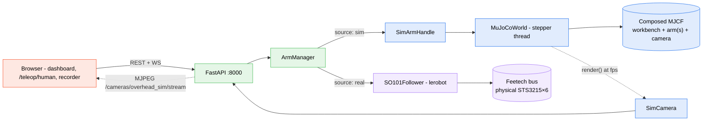
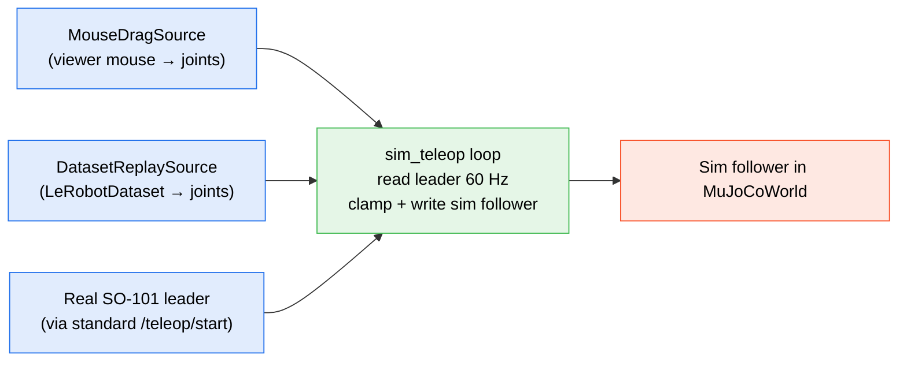

The HMI can drive a simulated SO-101 instead of a physical one. The browser surface is identical (per-arm panels, leader↔follower teleop, human-pose and Quest VR teleop, dataset recorder, MJPEG camera streams) — you just point the backend at a sim config file and `lerobot`'s `SO101Follower` is replaced by a `SimArmHandle` that writes joint goals to a MuJoCo world running in the same process.

Three preset configs ship in `hmi/backend/`: **solo follower**, **bimanual**, and **leader+follower**. Each is a single yaml.

<Callout type="info">
**Status (2026-08-09).** Shipped on `main`. `SimArmHandle` is a drop-in replacement for `SO101Follower`; the existing teleop loops, dataset recorder, and HMI panels work against sim without code changes. The MuJoCo physics + a vendored [trs_so_arm100](https://github.com/AlexanderKoch-Koch/trs_so_arm100) MJCF for the arm are the new pieces. The bimanual preset has since grown a full [pick-and-place arena](#the-arena) with five framed cameras and tuned grasp friction, is driven from a Meta Quest via [Quest VR teleop](/docs/hmi/quest-vr-teleop), and now has **seeded per-episode resets and an automatic success predicate** — headset hours produce auto-labelled LeRobot datasets with no arms powered.
</Callout>

## Architecture



The substitution lives at the `ArmManager` layer. Anything above it (REST endpoints, telemetry WS frames, teleop sessions, recording) is identical between real and sim.

## Why sim-first: measurability, not safety

The usual argument for starting in simulation is that nothing can break. That is true, and it is not the point.

The point is that **only sim can tell you whether the policy works.** Training loss — L1 on actions against a held-out slice of demonstrations — is a *proxy*. It answers "does this policy predict what the operator did", which is not the question. The question is "does this policy accomplish the task", and the only honest measurement of that is **task success over closed-loop rollouts**: put the policy in charge, let it run, count how often the cube ends up on the pad.

On the real rig that measurement costs a human. Someone resets the bench between rollouts, watches each one, and decides whether it counted. That is a few tens of trials a day at best — not enough resolution to tell two checkpoints apart.

In sim the same measurement is `N` seeded resets and a predicate, at **zero human cost** — and because the resets are seeded, two checkpoints are compared on the *same* N scenes rather than on whatever the bench happened to look like that afternoon.

That is what [`POST /sim/scene/reset`](#post-simscenereset) and the [task monitor](#the-success-predicate-in-words) exist for, and it is why they were built before any policy was trained: an objective you cannot measure cheaply is an objective you will end up optimising by vibes.

The safety is real too. It is just the second reason.

## Install

The `mujoco` Python package is pinned in `hmi/backend/pyproject.toml`. Editable installs already have it; otherwise:

```bash
source ~/venvs/haller-hmi/bin/activate-haller-hmi
pip install -e hmi/backend
```

The HMI runs headless by default and uses **EGL** for offscreen rendering. If your host lacks EGL, fall back to OSMesa:

```bash
export MUJOCO_GL=osmesa   # or 'egl' (default), or 'glfw' for the interactive viewer
```

## The three presets

| Preset | Config | Arms | Scene |
|---|---|---|---|
| Solo follower | `hmi/backend/config.solo-sim.yaml` | 1 sim follower (right) | workbench + 2 cubes |
| Bimanual | `hmi/backend/config.bimanual-sim.yaml` | 2 sim followers (left + right) | [teleop arena](#whats-in-the-mjcf) — bench, place zone, 3 cubes, 5 cameras |
| Leader+follower | `hmi/backend/config.leader-follower-sim.yaml` | 2 sim arms (one drives, one mirrors) | workbench, no cubes |

Bring any one up with the `--config` flag (see [HMI overview](/docs/hmi/overview#choosing-a-config) for the flag itself):

```bash
./scripts/run_hmi.sh --config hmi/backend/config.solo-sim.yaml
```

Then open the HMI at `http://localhost:3000`. Joint sliders, presets, and the overhead camera all work against the sim. The MJPEG stream is at `http://localhost:8000/cameras/overhead_sim/stream`.

## Watching the physics

Two options:

### Headless (default) — watch through the HMI camera

The HMI's sim cameras stream the scene to the browser exactly like a real `opencv` camera. The bimanual preset renders five views — the two operator cameras at 960×720, the overhead and both wrist cams at 640×480 — and every `fps` is set to match `telemetry.hz` (30) so each recorded frame carries a fresh render. Good for desktop dev and for any flow that uses the dataset recorder (which needs a camera in the config either way).

### Interactive MuJoCo viewer

```bash
MUJOCO_VIEWER=1 ./scripts/run_hmi.sh --config hmi/backend/config.leader-follower-sim.yaml
```

Opens a desktop MuJoCo window with mouse-drag perturbation. Required for the leader+follower preset's mouse-drag mode (below) — there's no way to drag arm joints without the viewer.

## Leader+follower modes

The leader+follower preset has three operating modes for the leader side. They differ only in what the new `/teleop/sim/start` endpoint is told to read from:



### Mouse-drag (default)

```bash
MUJOCO_VIEWER=1 ./scripts/run_hmi.sh --config hmi/backend/config.leader-follower-sim.yaml
```

Then start a sim teleop session:

```bash
curl -X POST http://localhost:8000/teleop/sim/start \
    -H 'Content-Type: application/json' \
    -d '{"follower":"right","leader":{"source":"mouse","arm_name":"left"},"hz":60}'
```

Drag the LEFT arm's joints in the MuJoCo viewer — the RIGHT arm mirrors at 60 Hz.

### Dataset replay

```bash
curl -X POST http://localhost:8000/teleop/sim/start \
    -H 'Content-Type: application/json' \
    -d '{"follower":"right","leader":{"source":"replay","dataset_path":"/path/to/lerobot/dataset"},"hz":30}'
```

Replays the action stream from a recorded LeRobotDataset on the sim follower. Useful for sanity-checking that a dataset captures what you think it does, without spinning up the real arms.

### Real leader → sim follower

Edit `hmi/backend/config.leader-follower-sim.yaml` and switch the LEFT arm from `source: sim` to `source: real`, with the right `port` and `calibration_id`. Then use the **regular** `/teleop/start` endpoint — the HMI's existing `TeleopSession` does the rest:

```bash
curl -X POST http://localhost:8000/teleop/start \
    -H 'Content-Type: application/json' \
    -d '{"leader":"left","follower":"right","hz":60}'
```

This is one direction: real → sim. The opposite (sim leader → real follower) intentionally requires `/teleop/sim/start` and a `MouseDragSource` / `DatasetReplaySource` — you don't want a sim arm driving a physical one accidentally.

## What's in the MJCF

Each preset's world is composed at boot from three pieces:

- `sim/assets/scenes/workbench.xml` — the arena: bench, floor, backdrop, place zone and lighting.
- The vendored `trs_so_arm100` MJCF for each arm, instanced once per `arms:` entry with `source: sim`.
- Cubes, dealt from `sim/assets/scenes/cube.xml` into measured slots (`sim_cubes`).

`hmi/backend/haller_hmi/sim/builder.py` is the composer, and it also emits the two cameras. CamelCase ↔ snake_case translation between MJCF joint names and HMI joint names lives in `hmi/backend/haller_hmi/sim/arm.py`.

### The arena

| element | geometry |
|---|---|
| workbench | 1.2 × 0.9 m box, top at `z=0` |
| arena floor | plane flush with the bench underside (`z=-0.02`), darker — catches a cube swept off the edge instead of letting it accelerate away forever |
| backdrop | 2.4 × 0.45 m at `y=+0.5`. **Visual only** — `contype`/`conaffinity` 0, so it can never become a surface an arm leans on or that the collision guard would have to know about |
| place zone | 0.12 × 0.12 m blue pad at `(0, -0.21)`, 2 mm proud |
| cubes | 4 cm, one colour each, up to 5 slots sized to each arm's folded-elbow reach band |
| lights | overhead at `(0,0,1.5)`, plus a **shadowless** operator-side fill — the overhead light keeps sole ownership of shadows, which are the cue for how high a gripper is |

### The cameras

| camera | pose | fovy | recorded as | reads well |
|---|---|---|---|---|
| `overshoulder` | `(0, 0.44, 0.56)` → `(0, -0.16, 0.04)` | 48 | — | **the default view** — the `behind` stance's eye, from the mount side looking along the arms |
| `threequarter` | `(0, -0.72, 0.54)` → `(0, -0.14, 0.04)` | 46 | `top` | the face-to-face eye — hand pitch, jaw-vs-cube alignment, height via shadow |
| `overhead` | `(0, 0, 1.0)` straight down | 60 | — | `shoulder_pan`, plan-view cube positions |
| `left_wristcam` / `right_wristcam` | inside each `Fixed_Jaw` — rides the wrist | 70 | `left_wrist` / `right_wrist` | millimetres: the jaws centred, the pinch point and its shadow |

`camera_xyaxes(pos, target)` derives the MJCF basis from *where the camera is* and *what it looks at*, so a viewpoint stays readable instead of being six magic numbers nobody can adjust later. `overshoulder` is listed first in the bimanual config, making it the cockpit BASE tile and the headset HUD default; tests pin every cube slot, the place zone and both mounts inside both operator cameras' frusta.

**Five render, three are recorded** — `threequarter` → `top`, plus the two wrist cams — and that split is a training decision, not plumbing. The full argument (π0.5's camera slots, armnetbench's key names, and why every recorded camera costs sample rate) is in [dataset collection](/docs/data/dataset-collection#the-camera-set-is-3-of-5-deliberately).

### Grasp friction

The finger pads run **slide friction 2.0** where the vendored MJCF ships 1.0 — upstream tuned for bare PLA, the real pads are rubber TPU, and at 1.0 a pinched 4 cm cube slips out mid-transport. MuJoCo combines a contact pair by `max`, so this one value governs pad-cube friction on its own.

<Callout type="warn">
That friction value lives in the **vendored** `sim/assets/so101/so_arm100.xml`. Re-vendoring `trs_so_arm100` silently reverts it, and the symptom is subtle: picks still work, transports drop.
</Callout>

Driving this arena from a headset is [Quest VR teleop](/docs/hmi/quest-vr-teleop) — including the collision guard's sim margins and why the place zone sits where it does.

## Collecting episodes in sim

### The per-episode loop

```
POST /sim/scene/reset  {"seed": 1000+i}    →  deal the bench, reproducibly
POST /record/start     {"repo_id", "task"} →  begin the episode
                                              (teleop the demonstration)
POST /record/stop      {"save": true}      →  save
GET  /sim/task/status                      →  did it actually succeed?
```

Repeat with `seed` incremented. Because the seed is part of the loop, a run is re-creatable from its seeds alone: the same seed and the same `RandomSpec` produce byte-identical cube poses, colours and lighting. (Warm-start accelerations and `qacc` are zeroed on every reset, which is what makes "same seed, same trajectory" true rather than approximately true.)

The recorder's own `success` / `success_frames` — in `GET /record/status`, and in the saved episode's `next.reward` column — is the same signal latched over the take; `/sim/task/status` is the live view of it. See [dataset collection](/docs/data/dataset-collection#the-schema) for the schema those episodes land in.

### `POST /sim/scene/reset`

```bash
curl -X POST http://localhost:8000/sim/scene/reset \
    -H 'Content-Type: application/json' \
    -d '{"seed": 1042, "randomize": true, "home_arms": false}'
```

| field | default | meaning |
|---|---|---|
| `seed` | `null` | Reproducibility. `null` draws fresh entropy. |
| `randomize` | `true` | `false` restores the exact baseline — the builder's home slots, palette and authored lighting. It *undoes* a previous randomization rather than layering on top of it. |
| `home_arms` | `false` | Send both arms home first, through the same bounded motion path as `/arm/{id}/home`, and wait for the ramps before dealing the cubes (otherwise the arms sweep the cubes off the slots they were just placed on). Off by default: a reset mid-session should move the bench, not the robot. |

Returns the same body as `GET /sim/scene`: every cube's `pos`/`quat`/`rgba`, every light's `pos`/`diffuse`, the fixed cameras' `pos`, plus `last_seed`, `randomized` and `reset_count` — read back from the model rather than replayed from the plan, so what it reports is what the simulator actually holds.

<Callout type="warn">
**`home_arms: true` is refused with 409 while a take is recording.** Sending the arms home underneath an open episode would splice a move nobody demonstrated into the middle of the take — and unlike the cube reset, that lands in the `action` column, not just the observation.
</Callout>

The reset also clears the task monitor's accumulated held time, so a cube still sitting on the pad when the last episode ended cannot carry its qualifying streak into the next one.

### `sim_seed` in the config

```yaml
sim_seed: 20260809     # null (the default) means "don't reset at startup"
```

Seeds the **first** reset, applied at startup, so a run is re-creatable from its config alone. Per-episode resets pass their own seed and ignore it. `null` leaves the bench on the builder's home slots, exactly as it was before this existed.

### What randomization varies

| varied | default amount |
|---|---|
| cube (x, y) around its home slot | ±0.04 m uniform per axis, rejection-sampled to keep ≥0.06 m centre-to-centre between cubes at overlapping heights, and clear of the bench edge by the cube's own footprint + 0.02 m |
| cube yaw about world +z | ±π rad (a cube is 90°-symmetric, so anything past π/4 is already "any heading") |
| cube colour | permuted **among the cubes**, so "the red one" isn't always in the same slot. The palette itself doesn't change, so a task instruction can still name a colour |
| light position | ±0.15 m per axis |
| light diffuse intensity | ±15 %, one scale per light — shaking the channels independently would *tint* the light, a much louder axis of variation than "a bit brighter" |
| fixed camera position | **0.0 — off by default** |

Camera jitter is off on purpose: those cameras are what the recorder saves, so moving them changes the **observation distribution itself** and throws away the framing solved for in `sim/builder.py`. Turn it on only if you specifically want viewpoint robustness and are willing to re-check that the bench still fills the frame.

Cube *height* is not randomized — it stays on the builder's vertical stagger, which is what keeps two cubes on different laps from ever sharing space.

### What needs a restart instead

**Cube count (`sim_cubes`) and cube size.** Everything the reset touches — free-joint `qpos`/`qvel`, `geom_rgba`, `light_*`, `cam_pos` — is safe to write on a *live* model. Changing the number or size of cubes means rebuilding the model, and a rebuild orphans every object holding the old one: the arm handles (built from joint ids), each `SimCamera`'s renderer (constructed from `world.model` on its own EGL thread), and every arm handle's world reference. So those are restart-time config, not randomizable parameters.

### The success predicate, in words

A frame scores when **all** of these hold at once for the cube being watched:

1. the cube is **in contact with the `place_zone` geom** — from MuJoCo's contact list, which the step that just ran already populated;
2. its centre is inside the pad's half-extent **shrunk by `zone_inset_m`** (0.01 m by default; the pad's half-extent is 0.06 m, so the acceptance box is 0.05 m) — a cube balanced half off the edge doesn't count;
3. it is **settled**: linear speed &lt; `lin_vel_eps` (0.01 m/s) and angular speed &lt; `ang_vel_eps` (0.1 rad/s — looser, because a cube rocking to rest spins fast at tiny amplitude and would otherwise never qualify);
4. **the robot has let go** (`require_release`, on by default): no arm geom is touching the cube.

…and that has held **continuously for `settle_s` (0.5) SIM seconds** — `data.time`, not wall clock. The stepper paces itself to real time so the two normally agree, but a test driving `mj_step` in a tight loop advances sim time far faster than the wall, and a paused world advances it not at all. Sim time is the clock that matches what the physics actually did.

Two of those four deserve their reasons spelled out:

- **Contact, not height.** The obvious test — "is the cube's z above the pad?" — does not survive the numbers. A cube dropped on the pad settles at **z ≈ 0.0219**; the same cube on the bare bench settles at **z ≈ 0.0199**. That is a 2 mm discriminator against a 1 mm-thick pad, well inside the noise of a cube that landed on a corner and rocked. The contact list says exactly which geoms touch which, and costs nothing to read.
- **Release, not just rest.** Without it, success fires while the gripper is still pressing the cube onto the pad — the cube is on the zone and not moving *precisely because* the robot is holding it there. That labels the middle of a place as the end of one. The release test uses the **whole arm**, not just the jaws: a cube pinned under a forearm is no more placed than one still in the fingers.

`GET /sim/task/status` returns `success`, `held_s`, `per_cube` (each cube's instantaneous `placed` and its `held_s`), `target`, `settle_s` and `sim_time_s`. The thresholds it ran with are written into every recorded dataset's `haller_scoring` block, because [the thresholds *are* the label definition](/docs/data/dataset-collection#haller_scoring-in-infojson).

## REST surface (sim-only)

| Method | Path | Body | Notes |
|---|---|---|---|
| POST | `/sim/scene/reset` | `{ seed?, randomize?, home_arms? }` | Re-deal the bench. 409 if `home_arms` and a take is recording. |
| GET | `/sim/scene` | — | Live cube / light / camera state, `last_seed`, `reset_count`. |
| GET | `/sim/task/status` | — | Success predicate, per cube, in sim time. |
| POST | `/teleop/sim/start` | `{ follower, leader: { source, arm_name?, dataset_path? }, hz? }` | Start sim leader → sim follower bridge. 409 if any teleop is running. |
| POST | `/teleop/sim/stop` | — | Stop the sim-teleop bridge. |
| GET | `/teleop/sim/status` | — | Current state, configured arms, source kind. |

There is no global "sim mode" flag: the MuJoCo world exists **iff** some arm is `source: sim`, and that is the test every one of these routes makes.

Everything else (arm goals, mode, calibration, leader/follower, human teleop, dataset recorder, cameras) reuses the existing endpoints documented in [HMI overview](/docs/hmi/overview).

## Troubleshooting

- **`GLFWError: X11: Failed to open display`** — `MUJOCO_GL=glfw` requires a display. Use `MUJOCO_GL=egl` (default) or `MUJOCO_GL=osmesa` for headless.
- **Sim camera frame is all black** — check the `<light>` in `sim/assets/scenes/workbench.xml` is in the composed MJCF (it always is — the builder includes the workbench unconditionally) and that the camera's `pos` and aim actually point at the scene. The camera definitions live in `hmi/backend/haller_hmi/sim/builder.py`.
- **`observation.effort` is all zeros in a sim take** — sim effort is only meaningful with **torque on**. A torque-off actuator still applies its bias term and would read as saturated, so the sim handle reports 0.0 instead of the raw number. Check the arm's torque state before blaming the recorder.
- **`lerobot.policies` import error on the dev laptop** — unrelated to the sim. Local scipy/numpy ABI quirk; VLA policy code lives on RunPod, not on the laptop.

## Out of scope (for now)

- **Automated closed-loop rollouts.** Everything needed to *score* them exists (seeded reset + task monitor); what's missing is the driver that loads a policy and runs the loop N times. Belongs on RunPod alongside `scripts/runpod/`.
- Randomizing anything that requires a model rebuild — cube count, cube size, textures.
- Bench-material randomization. The cube geoms carry no material, which is why writing `geom_rgba` works on them; the bench *does* (`bench_mat`), and MuJoCo renders a material's colour for a geom that has one — writing its `geom_rgba` is a silent no-op. Randomizing the bench means `model.mat_rgba`.

## Design reference

- Design spec: [`docs/superpowers/specs/2026-05-23-so101-mujoco-sim-trio-design.md`](https://github.com/oscardvs/haller_ws/blob/main/docs/superpowers/specs/2026-05-23-so101-mujoco-sim-trio-design.md)
- Implementation plan: [`docs/superpowers/plans/2026-05-23-so101-mujoco-sim-trio.md`](https://github.com/oscardvs/haller_ws/blob/main/docs/superpowers/plans/2026-05-23-so101-mujoco-sim-trio.md)
- Vendored arm MJCF: [AlexanderKoch-Koch/trs_so_arm100](https://github.com/AlexanderKoch-Koch/trs_so_arm100)
