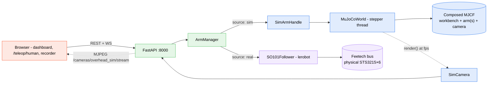
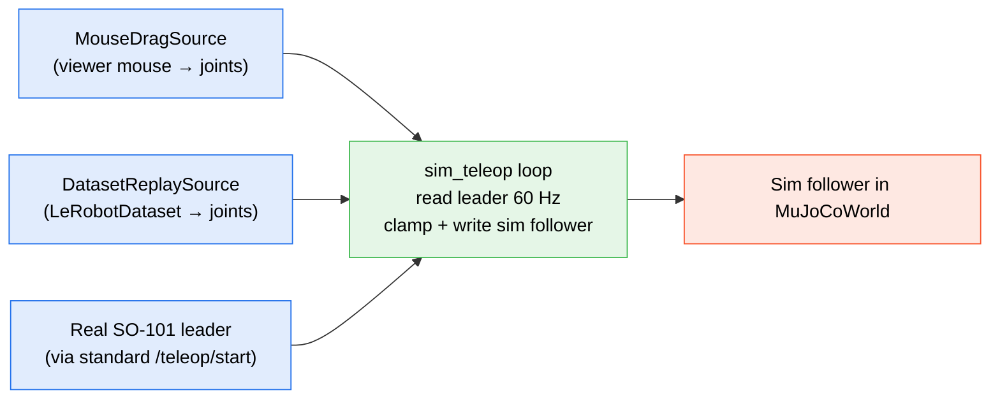

The HMI can drive a simulated SO-101 instead of a physical one. The browser surface is identical (per-arm panels, leader↔follower teleop, human-pose teleop, dataset recorder, overhead MJPEG camera) — you just point the backend at a sim config file and `lerobot`'s `SO101Follower` is replaced by a `SimArmHandle` that writes joint goals to a MuJoCo world running in the same process.

Three preset configs ship in `hmi/backend/`: **solo follower**, **bimanual**, and **leader+follower**. Each is a single yaml.

<Callout type="info">
**Status (2026-08-08).** Shipped on `main`. `SimArmHandle` is a drop-in replacement for `SO101Follower`; the existing teleop loops, dataset recorder, and HMI panels work against sim without code changes. The MuJoCo physics + a vendored [trs_so_arm100](https://github.com/AlexanderKoch-Koch/trs_so_arm100) MJCF for the arm are the new pieces. The bimanual preset has since grown a full [pick-and-place arena](#the-arena) with two framed cameras and tuned grasp friction, and is driven from a Meta Quest via [Quest VR teleop](/docs/hmi/quest-vr-teleop) — headset hours produce LeRobot datasets with no arms powered.
</Callout>

## Architecture



The substitution lives at the `ArmManager` layer. Anything above it (REST endpoints, telemetry WS frames, teleop sessions, recording) is identical between real and sim.

## Install

The `mujoco` Python package is pinned in `hmi/backend/pyproject.toml`. Editable installs already have it; otherwise:

```bash
source ~/venvs/haller-hmi/bin/activate-haller-hmi
pip install -e hmi/backend
```

The HMI runs headless by default and uses **EGL** for offscreen rendering. If your host lacks EGL, fall back to OSMesa:

```bash
export MUJOCO_GL=osmesa   # or 'egl' (default), or 'glfw' for the interactive viewer
```

## The three presets

| Preset | Config | Arms | Scene |
|---|---|---|---|
| Solo follower | `hmi/backend/config.solo-sim.yaml` | 1 sim follower (right) | workbench + 1 cube |
| Bimanual | `hmi/backend/config.bimanual-sim.yaml` | 2 sim followers (left + right) | [teleop arena](#whats-in-the-mjcf) — bench, place zone, 3 cubes |
| Leader+follower | `hmi/backend/config.leader-follower-sim.yaml` | 2 sim arms (one drives, one mirrors) | workbench |

Bring any one up with the `--config` flag (see [HMI overview](/docs/hmi/overview#choosing-a-config) for the flag itself):

```bash
./scripts/run_hmi.sh --config hmi/backend/config.solo-sim.yaml
```

Then open the HMI at `http://localhost:3000`. Joint sliders, presets, and the overhead camera all work against the sim. The MJPEG stream is at `http://localhost:8000/cameras/overhead_sim/stream`.

## Watching the physics

Two options:

### Headless (default) — watch through the HMI camera

The HMI's sim cameras stream the scene to the browser exactly like a real `opencv` camera. The bimanual preset renders both at 640×480, and its `fps` is set to match `telemetry.hz` (30) so every recorded frame carries a fresh render. Good for desktop dev and for any flow that uses the dataset recorder (which needs a camera in the config either way).

### Interactive MuJoCo viewer

```bash
MUJOCO_VIEWER=1 ./scripts/run_hmi.sh --config hmi/backend/config.leader-follower-sim.yaml
```

Opens a desktop MuJoCo window with mouse-drag perturbation. Required for the leader+follower preset's mouse-drag mode (below) — there's no way to drag arm joints without the viewer.

## Leader+follower modes

The leader+follower preset has three operating modes for the leader side. They differ only in what the new `/teleop/sim/start` endpoint is told to read from:



### Mouse-drag (default)

```bash
MUJOCO_VIEWER=1 ./scripts/run_hmi.sh --config hmi/backend/config.leader-follower-sim.yaml
```

Then start a sim teleop session:

```bash
curl -X POST http://localhost:8000/teleop/sim/start \
    -H 'Content-Type: application/json' \
    -d '{"follower":"right","leader":{"source":"mouse","arm_name":"left"},"hz":60}'
```

Drag the LEFT arm's joints in the MuJoCo viewer — the RIGHT arm mirrors at 60 Hz.

### Dataset replay

```bash
curl -X POST http://localhost:8000/teleop/sim/start \
    -H 'Content-Type: application/json' \
    -d '{"follower":"right","leader":{"source":"replay","dataset_path":"/path/to/lerobot/dataset"},"hz":30}'
```

Replays the action stream from a recorded LeRobotDataset on the sim follower. Useful for sanity-checking that a dataset captures what you think it does, without spinning up the real arms.

### Real leader → sim follower

Edit `hmi/backend/config.leader-follower-sim.yaml` and switch the LEFT arm from `source: sim` to `source: real`, with the right `port` and `calibration_id`. Then use the **regular** `/teleop/start` endpoint — the HMI's existing `TeleopSession` does the rest:

```bash
curl -X POST http://localhost:8000/teleop/start \
    -H 'Content-Type: application/json' \
    -d '{"leader":"left","follower":"right","hz":60}'
```

This is one direction: real → sim. The opposite (sim leader → real follower) intentionally requires `/teleop/sim/start` and a `MouseDragSource` / `DatasetReplaySource` — you don't want a sim arm driving a physical one accidentally.

## What's in the MJCF

Each preset's world is composed at boot from three pieces:

- `sim/assets/scenes/workbench.xml` — the arena: bench, floor, backdrop, place zone and lighting.
- The vendored `trs_so_arm100` MJCF for each arm, instanced once per `arms:` entry with `source: sim`.
- Cubes, dealt from `sim/assets/scenes/cube.xml` into measured slots (`sim_cubes`).

`hmi/backend/haller_hmi/sim/builder.py` is the composer, and it also emits the two cameras. CamelCase ↔ snake_case translation between MJCF joint names and HMI joint names lives in `hmi/backend/haller_hmi/sim/arm.py`.

### The arena

| element | geometry |
|---|---|
| workbench | 1.2 × 0.9 m box, top at `z=0` |
| arena floor | plane flush with the bench underside (`z=-0.02`), darker — catches a cube swept off the edge instead of letting it accelerate away forever |
| backdrop | 2.4 × 0.45 m at `y=+0.5`. **Visual only** — `contype`/`conaffinity` 0, so it can never become a surface an arm leans on or that the collision guard would have to know about |
| place zone | 0.12 × 0.12 m blue pad at `(0, -0.21)`, 2 mm proud |
| cubes | 4 cm, one colour each, up to 5 slots sized to each arm's folded-elbow reach band |
| lights | overhead at `(0,0,1.5)`, plus a **shadowless** operator-side fill — the overhead light keeps sole ownership of shadows, which are the cue for how high a gripper is |

### The cameras

| camera | pose | fovy | reads well |
|---|---|---|---|
| `overhead` | `(0, 0, 1.0)` straight down | 60 | `shoulder_pan`, plan-view cube positions |
| `threequarter` | `(0, -0.88, 0.62)` → `(0, -0.12, 0.045)`, ~37° down | 50 | hand pitch, jaw-vs-cube alignment, height via shadow |

`camera_xyaxes(pos, target)` derives the MJCF basis from *where the camera is* and *what it looks at*, so a viewpoint stays readable instead of being six magic numbers nobody can adjust later. `threequarter` is listed first in the configs, making it the cockpit BASE tile, the headset HUD view, and the dataset's base camera; tests pin every cube slot, the place zone and both mounts inside its frustum.

### Grasp friction

The finger pads run **slide friction 2.0** where the vendored MJCF ships 1.0 — upstream tuned for bare PLA, the real pads are rubber TPU, and at 1.0 a pinched 4 cm cube slips out mid-transport. MuJoCo combines a contact pair by `max`, so this one value governs pad-cube friction on its own.

<Callout type="warn">
That friction value lives in the **vendored** `sim/assets/so101/so_arm100.xml`. Re-vendoring `trs_so_arm100` silently reverts it, and the symptom is subtle: picks still work, transports drop.
</Callout>

Driving this arena from a headset is [Quest VR teleop](/docs/hmi/quest-vr-teleop) — including the collision guard's sim margins and why the place zone sits where it does.

## REST surface (sim-only)

| Method | Path | Body | Notes |
|---|---|---|---|
| POST | `/teleop/sim/start` | `{ follower, leader: { source, arm_name?, dataset_path? }, hz? }` | Start sim leader → sim follower bridge. 409 if any teleop is running. |
| POST | `/teleop/sim/stop` | — | Stop the sim-teleop bridge. |
| GET | `/teleop/sim/status` | — | Current state, configured arms, source kind. |

Everything else (arm goals, mode, calibration, leader/follower, human teleop, dataset recorder, cameras) reuses the existing endpoints documented in [HMI overview](/docs/hmi/overview).

## Troubleshooting

- **`GLFWError: X11: Failed to open display`** — `MUJOCO_GL=glfw` requires a display. Use `MUJOCO_GL=egl` (default) or `MUJOCO_GL=osmesa` for headless.
- **Sim camera frame is all black** — check the `<light>` in `sim/assets/scenes/workbench.xml` is in the composed MJCF (it always is — the builder includes the workbench unconditionally) and that the overhead camera's `pos`/`euler` actually point at the scene. Adjust the `<camera name="overhead" ...>` in `hmi/backend/haller_hmi/sim/builder.py` if your scene is tall or off-center.
- **`lerobot.policies` import error on the dev laptop** — unrelated to the sim. Local scipy/numpy ABI quirk; VLA policy code lives on RunPod, not on the laptop.

## Out of scope (for now)

- Wrist cameras in sim.
- Domain randomization (textures, lighting, object pose).
- A closed-loop policy-eval CLI (belongs on RunPod alongside `scripts/runpod/`).

## Design reference

- Design spec: [`docs/superpowers/specs/2026-05-23-so101-mujoco-sim-trio-design.md`](https://github.com/oscardvs/haller_ws/blob/main/docs/superpowers/specs/2026-05-23-so101-mujoco-sim-trio-design.md)
- Implementation plan: [`docs/superpowers/plans/2026-05-23-so101-mujoco-sim-trio.md`](https://github.com/oscardvs/haller_ws/blob/main/docs/superpowers/plans/2026-05-23-so101-mujoco-sim-trio.md)
- Vendored arm MJCF: [AlexanderKoch-Koch/trs_so_arm100](https://github.com/AlexanderKoch-Koch/trs_so_arm100)
